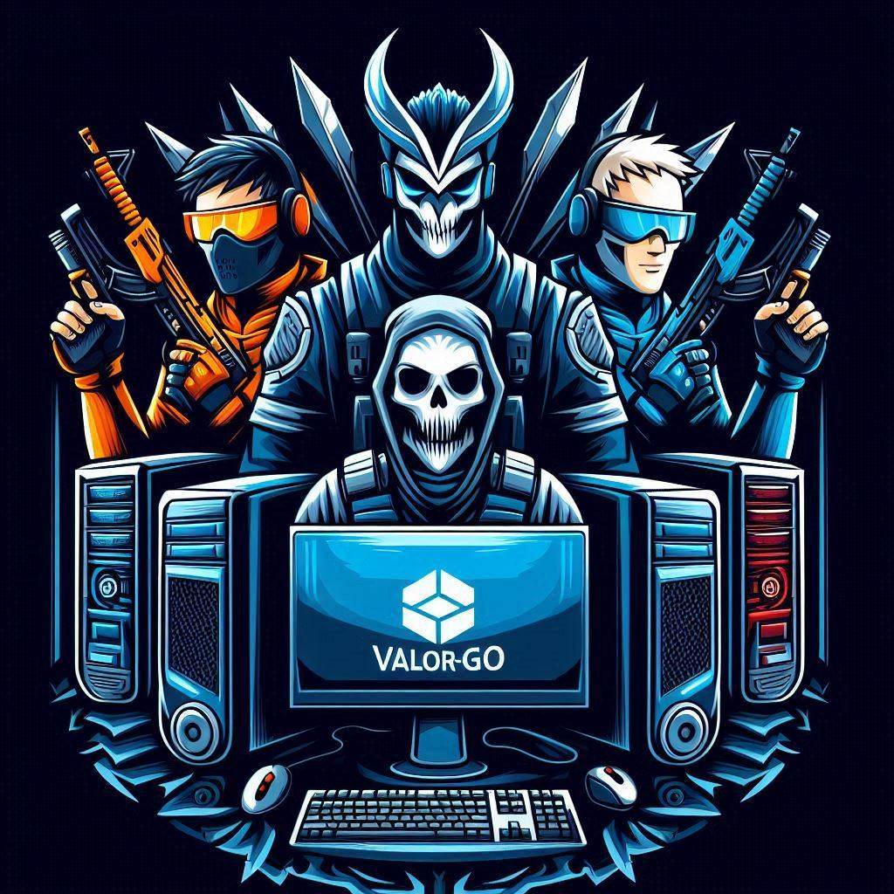

<h1 align="center">Hi 👋, We are team Valor-Go! </h1>
<h3 align="center">OSH-2025 @USTC</h3>

## Team Members
+ [Zucan Lv (吕祖灿)](https://github.com/zucanlv)
+ [Xiuning Liang (梁修宁)](https://github.com/rzx0420)
+ [Qihui Wang (王淇辉)](https://github.com/discrete-create)
+ [Yilin Yang (杨奕麟)](https://github.com/Alexyang1097)
+ [Zhuangzhuang Ren (任壮壮)](https://github.com/Renzz-ustc)

## Project Progress

| Project Phase        | Date                  | Project Progress                                                                                                                                                                                                 | Work Assignments                                                                                                                             |
|----------------------|-----------------------|-----------------------------------------------------------------------------------------------------------------------------------------------------------------------------------------------------------------|----------------------------------------------------------------------------------------------------------------------------------------------|
| Preliminary Research | 2025.03.07 - 2025.03.11 | First team meeting held on March 7th. Potential research directions were discussed based on course content and previous project topics. After initial deliberation on feasible directions, each member was assigned to investigate specific areas. | Zucan Lv: Investigate Rust refactoring/development Zhuangzhuang Ren: Investigate Ray Yilin Yang: Investigate 3FS Xiuning Liang: Investigate eBPF Qihui Wang: Investigate xv6 |
| Preliminary Research | 2025.03.12 - 2025.03.18 | Second team meeting convened on March 12th. Following Prof.Xing's feedback on proposed directions, the team decided to divide into two subgroups for further investigation.                                           | Zucan & Qihui: Study xv6 refactoring using Rust Yilin, Xiuning & Zhuangzhuang: Study 3FS innovation                                                                 |
| In-depth Research    | 2025.03.19 - 2025.03.27   | Third team meeting conducted on March 19th. After comprehensive discussion of research findings, the team finalized 3FS-related topics as the project focus and initiated intensive investigation                | All members: - Study Rust fundamentals and prerequisite knowledge of 3FS - Implement 3FS on local machines - Investigate evaluation tools - Conduct source code analysis through divided responsibilities |
| In-depth Research | 2025.03.28 - 2025.04.06 | Fourth team meeting conducted on March 28th. After one-week in-depth investigation in 3FS background and source code, we reach a consensus on upgrading the FUSE module in 3FS with RUST and XFUSE.| All members: - Dive into FUSE  - Make an investigation report together  - Make a feasibility report after investigation report
| Code Task| 2025.04.06 - 2025.04.11| Fifth team meeting conducted on April 7th. Finished two reports, we decided to put our hands on coding, to understand the real source code of 3FS and to refactor FUSE module with Rust. | All members: - Improve two reports  - Learn mixed compilation of Rust and C  - Understand 'usrconfig' file|
| Code Task| 2025.04.11 - 2025.04.14| Sixth team meeting conducted on April 11th. We discussed the progress about code understanding in recent days, and planned to furthur understand the `usrconfig` code while put our hands on refactoring the code with Rust.| All members:  - Read 3FS code  - Refactor `usrconfig.h`, `usrconfig.cc`|
| Interim Report| 2025.04.14 - 2025.04.20| Seventh team meeting conducted on April 14th. We discussed about the assignment about interim report, and everyone was appointed to accomplish one part. | Yilin: accomplish What   Xiuning: accomplish Why   Zhuangzhuang: accomplish How   Qihui: accomplish progress   Zucan: plan the report and integrate four parts|
| Interim Report| 2025.04.20 - 2025.04.23| Eighth team meeting conducted on April 20th. We discussed about the question raised by Prof. Xing and tried to solve it. | Yilin: revise part `What`   Zucan: delete some contents to prepare to present|
| Code Task| 2025.04.23 - 2025.05.09| Ninth team meeting conducted on Apirl 23th. Beceuse everyone in our team will have 2 or more mid-term exams, we decide not to assign specific task to individuals. We will try to dive into reading 3FS source code in spare time.| NONE due to exams|
| Code Task| 2025.05.09 - 2025.05.16| Tenth team meeting conducted on May 9th. Owing to mid-term exams and holidays, we stalled our project in last week. Now, we restart our coding task! We decide to devide us to two groups, one refactoring the code continuely and another one deploying and testing current code. | Zucan and Yilin: deploy and test current code.    Zhuangzhuang, Xiuning and Qihui: refactor the code continuely.|
| Code Task| 2025.05.16 - 2025.05.26| Eleventh team meeting conducted on May 16th. Members in 2 groups share and exchange everyone's experience and thought. Keep constructing our project for the next week.| Zucan and Yilin: try to deploy locally.    Zhuangzhuang, Xiuning and Qihui: refactor the code continuely.|
| Code Task| 2025.05.26 - 2025.06.07| Twelveth team meeting conducted on May 26th. Members in 2 groups share and exchange everyone's experience and thought. | Zucan and Yilin: deploy on server and test current code.    Zhuangzhuang, Xiuning and Qihui: refactor the code continuely.|
| Code Task| 2025.06.07 - 2025.06.24| Thirteenth team meeting conducted on June 7th. Everyone in team shares himself's schedule in final weeks. Then we discuss how to implement Lab4 and further schedule of our project. | Zucan: implement Lab4 and deploy 3FS locally.  Yilin: deploy 3FS in the cloud and test current code.    Zhuangzhuang, Xiuning and Qihui: refactor the code continuely.|
| Final spurt| 2025.06.25| Complete basic refactoring|Everyone works together in a study room.| 
| Final spurt| 2025.06.26| Complete universal deployment|Everyone works together in a study room|
| Final spurt| 2025.06.27| Complete universal deployment and functional testing|Everyone works together in a study room|
| Final spurt| 2025.06.28| Implement and confirm functions and safety and prepare for thesis denfense & final report|Everyone works together in a study room| 
<h3 align="left">Connect with us:</h3>

Yilin Yang: yangyiln@mail.ustc.edu.cn

Zhuangzhuang Ren: rzz18856919896@mail.ustc.edu.cn

Qihui Wang: PB23111637@mail.ustc.edu.cn

Xiuning Liang: rzx0420@mail.ustc.edu.cn

Zucan Lv: zucanlv@mail.ustc.edu.cn

<h3 align="left">Languages and Tools:</h3>

    <a href="https://git-scm.com/" target="_blank" rel="noreferrer">  
