# Valor-Go 可行性报告
## Rust升级3FS中的FUSE模块
## 团队成员
**吕祖灿 王淇辉 梁修宁 任壮壮 杨奕麟**
## 目录
- [Valor-Go 可行性报告](#valor-go-可行性报告)
  - [Rust升级3FS中的FUSE模块](#rust升级3fs中的fuse模块)
  - [团队成员](#团队成员)
  - [目录](#目录)
  - [1. Rust基础和语言特点](#1-rust基础和语言特点)
    - [1.1 RUST概述](#11-rust概述)
    - [1.2 语言特点](#12-语言特点)
      - [1.2.1 内存安全：](#121-内存安全)
      - [1.2.2 借用检查（Borrow Checker）](#122-借用检查borrow-checker)
      - [1.2.3 性能](#123-性能)
    - [1.3 性能调优实践](#13-性能调优实践)
      - [1.3.1 避免虚假共享](#131-避免虚假共享)
      - [1.3.2 无锁数据结构](#132-无锁数据结构)
  - [2. 3FS基础、架构分析与特性分析](#2-3fs基础架构分析与特性分析)
    - [2.1 3FS组成部分](#21-3fs组成部分)
    - [2.2 3FS架构分析](#22-3fs架构分析)
      - [2.2.1集群管理器](#221集群管理器)
        - [总述](#总述)
        - [mgmtd](#mgmtd)
        - [租约](#租约)
        - [心跳机制](#心跳机制)
        - [ROUTINGinfo](#routinginfo)
        - [切主操作](#切主操作)
      - [2.2.2 元数据服务](#222-元数据服务)
        - [总述](#总述-1)
        - [inode表](#inode表)
        - [目录项表](#目录项表)
      - [2.2.3 存储服务](#223-存储服务)
        - [总述](#总述-2)
        - [CRAQ（Chain Replication with Apportioned Queries）](#craqchain-replicationwith-apportioned-queries)
          - [CR 链式复制](#cr-链式复制)
          - [CRAQ](#craq)
  - [3. FUSE架构分析](#3-fuse架构分析)
    - [3.1 整体架构](#31-整体架构)
    - [3.2 实现细节](#32-实现细节)
      - [3.2.1 用户内核协议](#321-用户内核协议)
      - [3.2.2 库和API](#322-库和api)
      - [3.2.3 维护的队列](#323-维护的队列)
  - [4. XFUSE架构](#4-xfuse架构)
    - [4.1 FUSE的request工作流程（XFUSE的改进出发点）](#41-fuse的request工作流程xfuse的改进出发点)
    - [4.2 XFUSE的改进：Adaptive Waiting](#42-xfuse的改进adaptive-waiting)
    - [4.3 XFUSE的改进：Increased Parallelism](#43-xfuse的改进increased-parallelism)
    - [4.4 XFUSE的改进：Online Upgrade（RAS在线升级）](#44-xfuse的改进online-upgraderas在线升级)
  - [5. 具体的可行性分析](#5-具体的可行性分析)
    - [5.1 用Rust改写的可行性分析](#51-用rust改写的可行性分析)
      - [5.1.1 技术可行性](#511-技术可行性)
      - [5.1.2 开发成本](#512-开发成本)
    - [5.2 开发3FS的可行性](#52-开发3fs的可行性)
      - [5.2.1 源码的获取](#521-源码的获取)
      - [5.2.2 模块化设计](#522-模块化设计)
      - [5.2.3 硬件部署问题](#523-硬件部署问题)
    - [5.3 创新点](#53-创新点)
  - [6. 概要设计报告](#6-概要设计报告)
    - [6.1 计划实现目标](#61-计划实现目标)
    - [6.2 实现步骤](#62-实现步骤)
  - [参考文献](#参考文献)
## 1. Rust基础和语言特点
### 1.1 RUST概述
>虽然不是那么明显，但是 Rust 编程语言从根本上讲就是关于赋能的：无论你现在编写哪种代码，Rust 都能让你在更广泛的编程领域中比以前走得更远，更自信。
>例如，“系统级”工作涉及内存管理、数据表示和并发性的底层细节。传统上，这是一个神秘的编程领域，只有花费了必要时间来学习避免其臭名昭>著的陷阱的少数人才会涉及到。甚至那些实践者也要谨慎行事，以免代码>出现漏洞，崩溃或损坏。
>Rust 破除了这些障碍：它消除了旧的陷阱，并提供了一套友好、完善的工>具集帮助你，来打破这些障碍。需要“深入”到较底层控制的开发者可以使>用 Rust 来做到这一点，而无需担心崩溃或安全漏洞的常见风险，也无需>学习纷繁复杂的工具链细节。更好的是，Rust 语言旨在引导你自然地编写>出在运行速度和内存使用方面都高效的可靠代码。” 
—— Rust语言核心贡献者Nicholas Matsakis and Aaron Turon

作为一门以安全性和高性能著称的编程语言，Rust的特性与文件系统的核心需求高度契合。通过使用Rust重构3FS文件系统的关键模块，不仅能够有效提升系统的内存安全性和并发处理效率，还能在保持零成本抽象的前提下优化I/O性能，这项改造工作对提升文件系统可靠性具有重要实践价值。
### 1.2 语言特点
#### 1.2.1 内存安全：
+ 所有权系统（Ownership System）
  + 三原则
    + 唯一所有权：每个值有且仅有一个所有者
    + 作用域控制：值在所有者离开作用域时自动释放
    + 移动语义：赋值操作转移所有权而非复制数据（let y = x使x失效）

+ 堆栈协同管理
    + 栈内存：固定大小类型自动管理
    + 堆内存：通过Box<T>等智能指针显式分配
    + 自动调用drop函数释放资源（确定性析构）
#### 1.2.2 借用检查（Borrow Checker）
+ 引用规则
    + 不可变引用（&T）：允许同时存在多个
    + 可变引用（&mut T）：同一作用域仅允许一个且排斥其他引用
    + 生命周期约束：引用必须短于被引数据的存活周期
+ 数据竞争预防
    + 通过引用规则在编译期消除：
    + 多个线程同时写同一数据
    + 线程读写冲突（读时写或写时读）

达到的效果如下：
| 问题类型     | C/C++ 表现         | Rust 解决方案                  |
|--------------|--------------------|-------------------------------|
| 空指针解引用 | 段错误             | Option<T> 强制处理空值        |
| 悬垂指针     | 不可预测崩溃       | 借用检查器阻止无效引用        |
| 缓冲区溢出   | 内存破坏漏洞       | 数组边界检查（编译+运行）     |
| 数据竞争     | 难以调试的并发错误 | 所有权 + Send/Sync trait      |
#### 1.2.3 性能
+ 零成本抽象机制 [3]
  + 无运行时开销
    + async/await 编译为状态机，生成代码与手写回调效率相当
```rust
// 编译前（高阶抽象）
async fn task() {
    let data = fetch_data().await;
    process(data).await;
}

// 编译后（等价手写优化）
struct TaskFuture { state: i32 }
impl Future for TaskFuture {
    type Output = ();
    fn poll(mut self: Pin<&mut Self>, cx: &mut Context) -> Poll<()> {
        match self.state {
            0 => { /* 状态机逻辑 */ }
            1 => { /* 无虚函数调用 */ }
            _ => unreachable!()
        }
    }
}
```
基准测试：Rust async任务切换耗时约 3ns，Go goroutine切换约 100ns
  + 内存布局优化
    + 所有权系统确保数据局部性
    + 结构体默认紧凑排列（无GC头信息）
```rust
struct Packet {
    timestamp: u64,  // 8B
    source_ip: [u8;4], // 4B 
    payload: Vec<u8>,  // 24B (指针+容量+长度)
} // 总计36B，无填充字节
```
+ 异步运行时性能
    + 事件驱动架构
    + Tokio 调度器单核可处理 500万 QPS（小消息）
    + Epoll/ Kqueue/ IOCP 多路复用实现：
```rust
// Tokio事件循环核心逻辑
loop {
  let mut events = vec![];
  poller.poll(&mut events, timeout)?;
  for event in events {
      let token = event.token;
      let (_, schedule) = slab.get(token).unwrap();
      schedule.schedule(); // 无锁任务唤醒
  }
}
```
### 1.3 性能调优实践
#### 1.3.1 避免虚假共享
``` rust
// 错误示例：
struct Counters {
    a: AtomicU64, // 与b在同一缓存行
    b: AtomicU64,
}

// 优化方案：
#[repr(align(64))]
struct AlignedCounter(AtomicU64);

struct Counters {
    a: AlignedCounter, // 独占缓存行
    b: AlignedCounter,
}
```
#### 1.3.2 无锁数据结构
crossbeam epoch GC 实现高效无锁队列：
```rust
let queue = crossbeam::queue::SegQueue::new();
queue.push(item);
let worker = crossbeam::utils::Backoff::new();
while let Some(data) = queue.pop() { ... }
```
## 2. 3FS基础、架构分析与特性分析
### 2.1 3FS组成部分

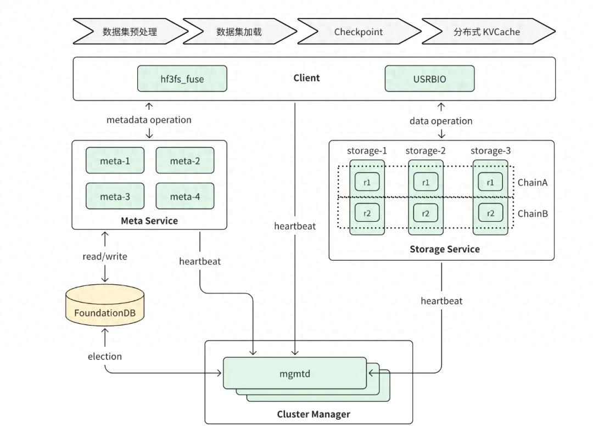
3FS高速文件系统构建在SSD存储节点网络上从而实现了其分布式的架构，同时应用了RDMA技术大大降低网络通信带来的数据传输延迟，在此层次之上，又分为了若干组成部分，共同实现了面向高频I/O，高吞吐量数据传输的需求，更保证了数据在分布式结构下的高容错性与强一致性。 3FS的主要组成部件如下4个：
+ 集群管理器 Cluster Manager：负责整个集群的节点管理和配置分发。由于3FS采用分布式架构，显然需要一个（或若干个）部件掌握每个节点的管控，包括节点状态信息的更新，查询，转发与广播。总体而言，相当与整个系统的控制中心与调度中心。为了希望系统在高速运行的情况下仍然可以进行工作，那么 就需要保证管理器的高可用性，因此引入多个管理器（mgmtd）节点，其中一个是主mgmtd，其余作为备mgmtd节点，在管理器节点故障时实现切换操作从而保证管理不中断。
+ 元数据服务 Metadata Service：元数据是关于数据的组织、数据域及其关系的信息，简言之，元数据就是描述数据的数据。 元数据服务类似于文件系统的“目录管理者”。所有关于文件和目录的名称、层次结构和属性信息都由它来处理。元数据服务是文件系统中一个常见架构，通过请求元数据服务，用户可以进行创建文件、打开文件、列出目录等”文件“操作。
+ 存储服务 Storage Service： 如同名字一般，存储服务提供关于数据的存储，由于3FS是搭建在SSD上的分布式架构，因此3FS会将每一份文件数据切分成若干个块（chunk），分配到各个存储节点中存储。由出于 **对高容错性的需求**，每一个chunk会在多个存储节点中以副本形式存储起来，以防某个存储节点崩溃导致数据丢失。而多副本的出现又会引入新的问题，那就是如何保证访问的某副本是所有副本中应该访问的那个，换言之，如何保证 **对数据一致性**的需求。3FS这里使用了CRAQ技术，从而保证了这一问题。整体上，3FS的存储部分充分利用了RDMA高速网络与SSD并发读的优势，最终实现了强一致性，写全读任意的优秀特性。
+ 客户端侧 Client：3FS集成了两个面向用户的端口：FUSE 和 USRBIO ，其中前者是广泛应用的文件系统——用户的端口，具有透明，高兼容性的优势，但性能会有所损耗；后者是针对3FS的原生客户端口，通过直接面向RDMA网络的设计，即绕开了需要与FUSE和内核的交互，从而可以实现**零拷贝的高速IO**，缺点是需要用户使用时修改以适配USRBIO端口。 
### 2.2 3FS架构分析
#### 2.2.1集群管理器

##### 总述
元数据服务和存储服务都会定期向集群管理器发送心跳，以报告自己的在线状态和健康情况。集群管理器监控这些心跳，从而在有节点加入、退出或故障时更新集群成员列表，并将最新的集群配置分发给其它服务和客户端。为了防止单点故障，集群管理器通常以多实例部署，通过选举保持一个主（Primary）节点。当主管理节点故障时，会自动切换（选举）另一个管理器为新的主节点，保证管理功能不中断。集群的配置数据（例如当前有哪些存储节点、链式复制的拓扑等）需要持久化保存以备恢复。
##### mgmtd
mgmtd即节点管理。3fs架构中可以允许多个mgmtd进行管理以提升可用性（即可用时间占总时间的比值，表征容错能力的大小）
分为主mgmtd以及多个备mgmtd：主管理拥有所有功能；备管理在切主之前只拥有查主功能。
##### 租约
各个节点需要申请服务时，需要向mgmtd申请租约，在租约期间内，节点拥有对于资源数据的占用，而其他节点无法访问（HDFS中是这样的，3fs应该也是，待验证）。
而mgmtd收到申请时，将此次租约的信息Leaseinfo，存储在foundationDB框架下的数据库内，方便后续查询以及切主操作。
##### 心跳机制
每个节点需要定期向主mgmtd进行心跳回报，以确认其的在线情况，若某个节点发生改变，那么主mgmtd可以得到这一信息。结合心跳机制，便可以进行周期性续租操作：
- 如果节点超过 T 秒（可配置，默认 60s）没有上报心跳，主 mgmtd 判断节点租约失效；
- 如果节点与主 mgmtd 超过 T/2 秒未能续上租约，本节点自动退出。
##### ROUTINGinfo

元数据和存储节点的信息，以及CRAQ 复制链表信息，共同组成了集群的路由信息ROUTINGinfo。路由信息由主 mgmtd 广播到所有的节点，每个节点在需要的时候通过它找到其它节点。
##### 切主操作
切主即切换主mgmtd，主要通过foundationDB中的[[feasibility_report.md#租约|Leaseinfo]]实现。

每隔10s，每个mgmtd进行一次Leaseinfo的check，若存在未失效的lease指向另外的mgmtd，那么不切主，否则变为新主。其中foundationDB的读写保证即使是每个mgmtd并行检查，最后也会串行一个个进行切主判断，保证最后只会产生小于等于一个的新主。

切主后，新主会静默一段长时间，进行全局配置以及保证老主mgmtd上的在行任务得到完成，最后再成为主mgmtd接管集群管理。
#### 2.2.2 元数据服务
##### 总述
3FS与业界其他分布式系统一样，选择使用分布式高性能KV存储系统以构建文件系统的元数据组件（即FoundationDB）。大致的Metadata 组件如下图所示：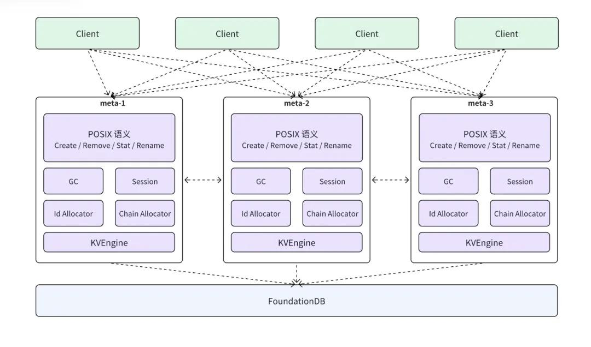
3FS有别于其他传统分布式文件系统（如HDFS，Ceph等）将元数据服务下沉到FoundationDB中去，利用FoundationDB的键值操作特性，极为简单地实现了元数据服务（如并发的解决通过事务冲突检测来实现）。其中Metadata Service 节点只是充当文件存储元数据的Proxy（代理），负责语义的解析。
另一方面，由于使用的FoundationDB是较为成熟的分布式事务键值数据库，3FS本身的元数据服务也是无状态的，有较强的独立性，从而多个元数据服务器可以并行处理不同请求；同时若两个Client“同时”进行相同文件操作导致冲突（比如创建或修改同名文件），只有一个会成功，另一个由于事务冲突导致失败。

##### inode表
每个文件或者目录都有唯一的一个inode编号。3FS使用64位ID作为inode，并作为键值对将信息存储在FoundationDB中。同时，为了避免inode过于集中从而失去分布式的优势，3FS会有意将inode均匀分布到数据库的不同节点进行存储，以下是不同类型inode的例子：
- 文件：包含基本属性，如拥有者，权限，时间戳以及长度，块信息，数据布局等（此即元数据，描述数据的数据）
- 目录：存储父目录的inode信息以及该目录的布局，从而可以看出文件系统整体的图论结构，（树与检查非环）
- 符号链接：表征目标路径字符串

##### 目录项表
目录内容以键值形式存储，每一个目录中的文件或子目录对应一个目录项记录。存储时，键设计为 "DENT" 前缀+父目录inode+文件名。
#### 2.2.3 存储服务
##### 总述
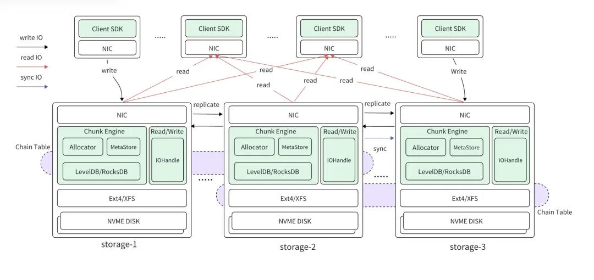
存储上，3FS使用如上图的多个存储节点进行数据存储，配套以chunk Engine 进行 chunk 分块管理。每个节点上通过 Ext4 或者 XFS 文件系统管理其上的多块 NVME DISK，并提供POSIX文件接口。读写上，多个存储节点存储着多个文件副本，形成一条条链式结构，用以支持CRAQ（链式复制的改进版本）进行读写操作。

##### CRAQ（Chain Replication with Apportioned Queries）
###### CR 链式复制
链式复制技术是为了解决分布式存储中高吞吐量与强一致性的矛盾而创造出来的一种技术，具体实现特点如下：
- 多个节点链接成一条链，每个节点中存储着到此节点为止的已确认confirmed的数据操作
- 所有的写操作从HEAD开始，按照链依次将此次更新传递到后继节点；在到达TAIL时，向前依次通知信号“已经写入完毕”
- 所有的读操作从TAIL实现，直接将TAIL存储的操作信息作为客户端查询结果。
这样做的好处是无论链中的哪一个节点崩溃，更新都会较为简单（类似链表的更新），并且由于从HEAD到TAIL上节点的更新信息是**递减的**，从而可以保证较好的一致性。
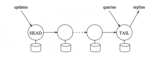
###### CRAQ
CRAQ是CR的改进版本，区别在于可以通过引入机制：每个节点存储多个数据版本，其中用dirty 和 clean作为区分。
- 写操作第一次途径链上某个节点时，会更新并且将此版本标记为dirty，当接收到从TAIL返回的信息时，再变为clean版本，并删除旧版本。
- 读操作时，若版本为clean，则直接读取；否则向链尾申请最新版本（链尾必然是clean的），然后读取。
相较于CR，CRAQ保证强一致性的同时允许多个节点同时读取，从而大大提高了读操作为主的工作环境下的吞吐量。

## 3. FUSE架构分析
### 3.1 整体架构
从高层视角来看 FUSE，一个 FUSE 文件系统包含三个部分：
+ 用户空间文件系统（用户空间实现）：实际执行文件操作的地方。开发者在用户空间中编写文件系统的逻辑，实现了对文件系统操作的处理（如文件的读写、创建、删除等）。这些操作由FUSE库与内核之间的通信完成。用户空间文件系统通过FUSE框架将这些操作暴露给内核，使得它们能够被操作系统和用户程序访问。
+ 内核态 FUSE driver，它对用户态暴露 /dev/fuse，用于用户态 FUSE deamon 和 内核通信，并负责管理和分发来自应用程序的 request
+ FUSE library（库）：提供了API，供开发者在用户空间中实现文件系统。它封装了对FUSE内核模块的调用，简化了用户空间文件系统的实现过程。通过调用这些API，用户空间文件系统可以处理各种文件系统操作，如挂载、读取文件内容、文件属性访问等，用户态的 FUSE deamon 基于 FUSE library 编写，实际上，这个库对 FUSE 操作进行了更高层的封装，使得基于 FUSE 构建文件系统更加容易
FUSE的整体工作过程如下图
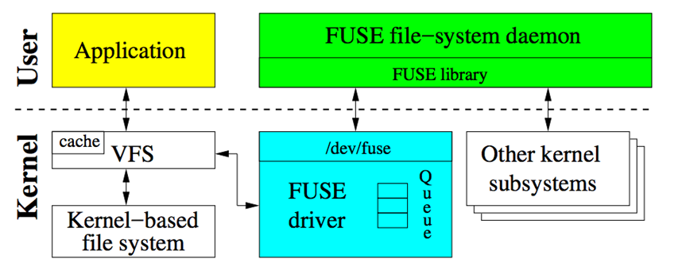

FUSE 的简化工作流程：

1. 用户空间 Application 发起对 FUSE 文件系统的文件操作
2. 内核态 VFS 将操作请求路由到 FUSE driver驱动程序
3. 根据请求类型，创建 FUSE request，并挂载到队列中
4. /dev/fuse 分发 request 给用户态的 FUSE deamon
5. FUSE deamon 根据收到的 request 执行对应的处理
6. 处理结束后，FUSE deamon 通过 /dev/fuse 发送 reply 告知内核
7. FUSE driver 将请求项从队列删除，将操作结果返回给用户程序

### 3.2 实现细节
#### 3.2.1 用户内核协议
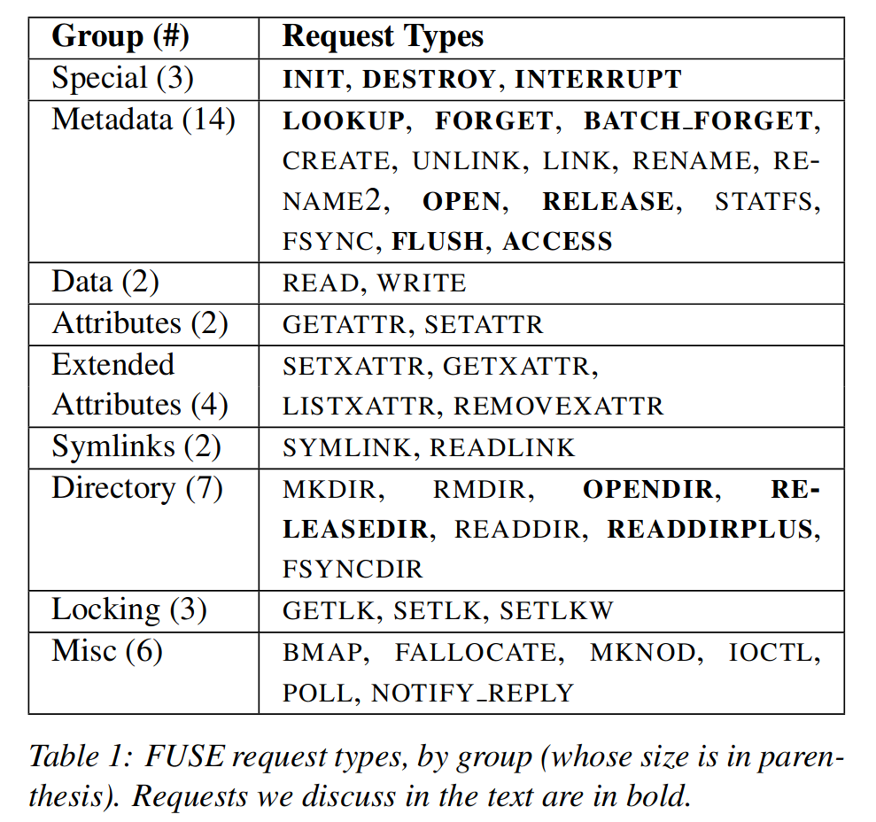

FUSE 的 43 种 request，其中加黑的与 VFS 操作语意有些出入。

+ INIT：当文件系统被挂载时由内核产生。用户和内核确认协议版本、相互支持的能力集合（如 READDIRPLUS 的支持），各种参数的设置（如 FUSE 预读大小、时间粒度）
+ DESTROY：当文件系统被卸载时由内核产生。FUSE deamon 执行清理工作，任何与该文件系统 request 都无法被送往用户空间处理，而后，FUSE deamon 将退出
+ INTERRUPT：由内核发出，用于停止某个 request（如一个等待 READ 的进程终止了）。

sequence#：每一个 request 都有一个唯一的 sequence# 用于识别，该序列号由内核分配
node ID：一个 64 位的无符号整数，用于在内核和用户空间识别 inode

+ LOOKUP：进行 path-to-inode 转换，每次 lookup 一个 inode 时，内核就将其放入 inode 缓存
+ FORGET & BATCH_FORGET：将 inode 从缓存中删除，并通知 FUSE deamon 释放相关数据结构
+ OPEN：打开文件，FUSE deamon 可以选择性地返回一个 64 位的文件句柄，而后每一个与该文件有关的 request 都将带有这个句柄

file handle：FUSE deamon 可以利用该句柄存储打开文件的信息，例如在栈文件系统中，FUSE 文件系统可以将底层文件系统的描述符存储为 FUSE 文件句柄的一部分

+ FLUSH：关闭文件
+ RELEASE：之前打开的文件没有任何引用时发出
+ OPENDIR & RELEASEDIR：与 OPEN 和 RELEASE 语义相同，但操作对象是目录文件
+ READDIR & READDIRPLUS：返回目录项，READDIRPLUS 还会返回每个项的元数据信息
+ ACCESS：内核用于确认用户进程对于某个文件是否具有访问权限

#### 3.2.2 库和API
在用户空间 FUSE 的 API 严格来说有两层，底层 API 负责实现与内核 FUSE driver 的基本通信，基于底层 API 所构建的高层 API 用于方便用户态文件系统的编写。

底层 API vs. 高层 API \(\approx\) flexibility vs. development ease

底层 API：

接收并翻译来自内核的 request
发送格式化的 reply
为文件系统的配置和挂载提供便利
为内核和用户空间隐藏可能的版本差异
高层 API 包含更多语义，尤其是隐藏了 path-to-inode map 的细节，从而高层 API 中都是直接操作文件路径的方法。

#### 3.2.3 维护的队列
FUSE 的队列存在于内核态，由 request 构成。FUSE driver 通过管理 request 队列进行 request 调度。FUSE 中包含 5 个不同的队列，分别用于管理不同种类的 request，同时，不同队列中的 request 具有不同的优先级，当 FUSE driver 决定发送哪个 request 给 FUSE deamon 时，优先级就会起到作用。

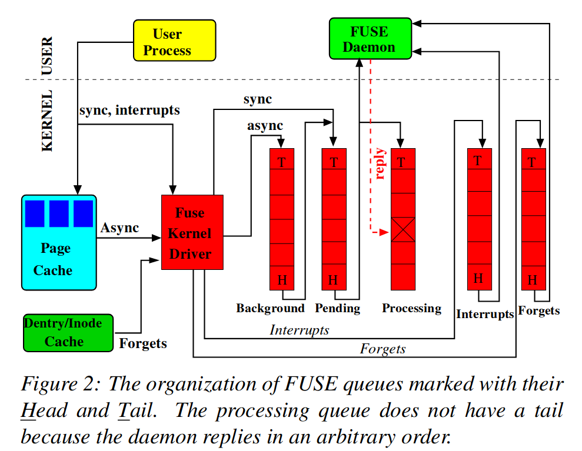

interrupts:INTERRUPT request
forgets:FORGET request
pending:同步 request
processing:正在处理的 request
background:异步 request

**FUSE 的工作流程**
以文件删除操作为例
```
|  "rm /mnt/fuse/file"               |  FUSE filesystem daemon
|                                    |
|                                    |  >sys_read()
|                                    |    >fuse_dev_read()
|                                    |      >request_wait()
|                                    |        [sleep on fc->waitq]
|                                    |
|  >sys_unlink()                     |
|    >fuse_unlink()                  |
|      [get request from             |
|       fc->unused_list]             |
|      >request_send()               |
|        [queue req on fc->pending]  |
|        [wake up fc->waitq]         |        [woken up]
|        >request_wait_answer()      |
|          [sleep on req->waitq]     |
|                                    |      <request_wait()
|                                    |      [remove req from fc->pending]
|                                    |      [copy req to read buffer]
|                                    |      [add req to fc->processing]
|                                    |    <fuse_dev_read()
|                                    |  <sys_read()
|                                    |
|                                    |  [perform unlink]
|                                    |
|                                    |  >sys_write()
|                                    |    >fuse_dev_write()
|                                    |      [look up req in fc->processing]
|                                    |      [remove from fc->processing]
|                                    |      [copy write buffer to req]
|          [woken up]                |      [wake up req->waitq]
|                                    |    <fuse_dev_write()
|                                    |  <sys_write()
|        <request_wait_answer()      |
|      <request_send()               |
|      [add request to               |
|       fc->unused_list]             |
|    <fuse_unlink()                  |
|  <sys_unlink()                     |
```


+ 用户程序发起文件系统操作 如rm /mnt/fuse/file
+ FUSE deamon 读 /dev/fuse，但此时 request 队列为空，因此触发 request_wait()，进入睡眠
用户程序触发系统调用 sys_unlink()，内核路由到 FUSE 操作函数，由将操作对应 request 加入 pending 队列，并唤醒 FUSE deamon
+ FUSE deamon 被唤醒后，将 requset 从 pending 队列移除，并将其加入 processing 队列
+ FUSE deamon 返回用户空间后，根据读到的 request 进行相应自定义操作
+ FUSE deamon 执行完操作后，向 /dev/fuse 写 reply，将对应 request 从 processing 队列移除，并唤醒等待的用户程序
+ 用户程序从内核系统调用返回，完成操作

## 4. XFUSE架构
### 4.1 FUSE的request工作流程（XFUSE的改进出发点）
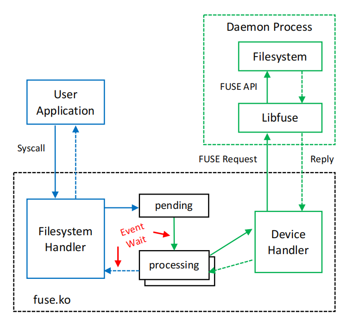
FUSE 请求从用户应用程序通过文件系统处理程序和设备处理程序流向文件系统守护进程。
文件系统处理完请求后，通过设备处理程序和文件系统处理程序向相反方向发送响应。
FUSE 使用内核事件来协调文件系统和设备处理程序之间的流程。
因此，FUSE 请求的延迟包括文件系统守护进程处理请求所需的时间以及两个事件等待的时间：
+ device handler等待一个到来的请求
+ request handler等待来自文件系统守护进程的响应
  
内核事件通知的发送时间约为几微秒
对于文件系统可以快速处理的请求，两次事件等待的开销是非常昂贵的

### 4.2 XFUSE的改进：Adaptive Waiting
为了避免这种开销，XFUSE 在事件等待中引入了忙等待或忙轮询的初始阶段。该等待方案如下图所示。设置了一个Busy-wait period，如果在繁忙等待期间满足进程所寻求的条件，则该进程将继续，而不会产生事件等待的成本。然而，如果在忙等待期间未满足所寻求的条件，则该方案将退回到常规事件等待。我们将此方案称为繁忙事件等待。
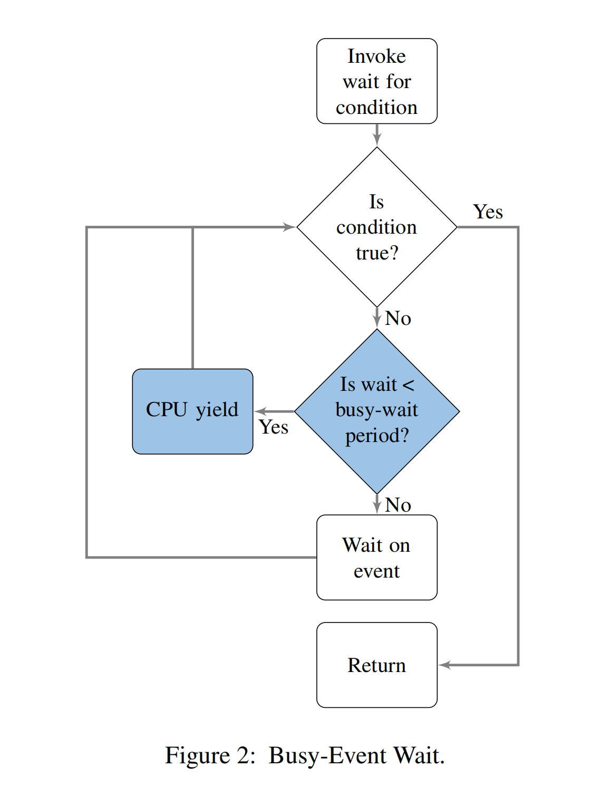


### 4.3 XFUSE的改进：Increased Parallelism
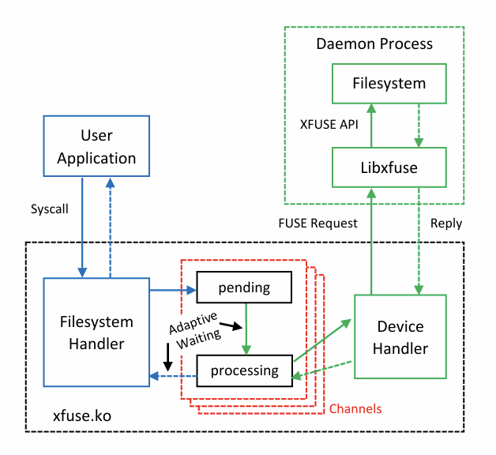
支持多个文件系统守护进程同时在多个核上处理请求

支持异步处理模型，使每个线程能够处理多个并发请求

在filesystem handler和device handler之间维护多个信道

每个信道有两个队列

一个新请求的空闲队列

一个正在处理的请求队列

对于一个新来的请求，守护进程会根据一个信道选择策略为请求分配信道

每个信道的另一端是一个等待处理新请求的守护进程

XFUSE 还确保在不同通道上工作的线程之间不会发生锁争用。

通道数和每个通道的请求槽数决定了 XFUSE 可以向文件系统守护进程提供的最大并发量。

### 4.4 XFUSE的改进：Online Upgrade（RAS在线升级）
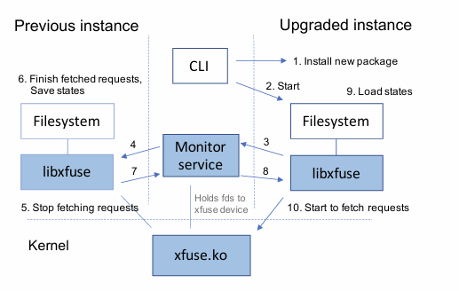
当一个文件系统守护进程终止时，特殊设备 /dev/fuse 的所有文件描述符都将关闭。这会导致内核自动卸载文件系统。

为了防止内核在文件系统守护进程升级期间卸载文件系统，XFUSE 提供了一个监视服务来保存所有 XFUSE 设备文件描述符，同时旧文件系统守护进程退出，升级后的新文件系统的新守护进程接管为运行中的应用程序提供服务。

XFUSE 包含一个库 libxfuse 来方便文件系统守护进程和 XFUSE 监控服务之间的交互。 Libxfuse 通过新功能和 API 扩展了 FUSE libfuse 库，允许使用它构建的用户空间文件系统支持在线升级。

## 5. 具体的可行性分析

### 5.1 用Rust改写的可行性分析
用Rust重写3FS文件系统的可行性

#### 5.1.1 技术可行性
+ Rust与FUSE的兼容性： Rust通过fuser库提供了与FUSE的良好集成。fuser封装了FUSE的低级接口，允许开发者用Rust实现文件系统的核心逻辑（如readdir、read、write等）
+ 安全性优势： Rust的内存安全特性（无数据竞争、避免空指针问题）非常适合文件系统开发，可以减少传统C实现中常见的bug（如缓冲区溢出）。对于3FS这种可能涉及复杂数据处理的系统，Rust能提升代码的健壮性。
+ 生态支持： Rust有丰富的异步编程支持（如tokio、async-std），Rust的工具链适合高并发或异步I/O。
+ Rust和C/C++在很多场景中都可以实现兼容：当前已经有很多成功的用Rust语言对C/C++代码改写的工作。Rust的性能与C/C++相当，因为它也是零成本抽象的语言。重写后，3FS的性能不会因为语言切换而下降，甚至可能通过Rust的优化（如更好的并发模型）有所提升。但是安全性一定会有提升，避免内存泄漏等问题
#### 5.1.2 开发成本
+ 学习曲线： 需要团队学习Rust的语法和所有权模型，初期会有一定的学习成本。但在代码工具等辅助下，熟练掌握后可以保证改写的正确性

### 5.2 开发3FS的可行性
#### 5.2.1 源码的获取
3FS文件系统在github上开源，其主要用C/C++代码完成绝大部分内容的编写。

#### 5.2.2 模块化设计  
+ 3FS采用模块化设计，选择对FUSE等部分模块改写，只需改写内容对应调整接口等即可，工作量可控

+ 采用原型验证-->逐步迁移-->性能测试的方法可以分析和调试改写的代码：
先重写核心逻辑，将3FS的小功能（如目录读取）逐个移植到Rust，确保其正确性之后再进行下个功能的移植。保留FUSE交互部分用C（通过FFI）。最后用Rust完全替换FUSE交互层。

#### 5.2.3 硬件部署问题
3FS可以在个人本机部署，由于硬件的限制，虽然无法对性能方面进行充分评测，但是可以检测改写和升级是否正确、代码能否运行。

### 5.3 创新点
当前有很多采用Rust改写的工作，3FS作为Deepseek大模型的高速文件系统，目前3FS由于开源时间较短，在Rust改写相关工作还有较大空白
FUSE作为用户空间文件系统模块，有很多相关的优化工作，如XFUSE、RFUSE等，对性能进行了提高，尝试将它们作为参考，应用到3FS的FUSE模块上
我们考虑采用Rust改写和参考XFUSE等对FUSE模块优化工作结合的方式，达到升级3FS的效果

## 6. 概要设计报告
### 6.1 计划实现目标
1. 用Rust改写现有3FS中C类语言编写的FUSE模块，提升内存安全性
2. 向3FS整体架构中，以类似于FUSE模块的方式，接入XFUSE模块，使得在不大幅影响3FS整体复杂度的情况下，实现`a * FUSE + (1-a) * XFUSE`的效果，其中`a`是可选参数

### 6.2 实现步骤
1. 初步可行性验证：使用循环设备来模拟多个存储节点在个人电脑上部署3FS，但是功能受限，仅能用于功能验证和开发实验，无法进行性能测试。
2. 使用Rust语言逐步改写3FS中的FUSE模块，渐进式改写各个具体文件
3. 完全熟悉3FS代码框架，将XFUSE接入3FS
4. （可选）在团队成员的多台个人电脑上实现3FS分布式部署，并进行功能验证和开发实验
5. （进阶）在团队成员多台个人电脑上实现3FS分布式存储，并用于训练小参数量语言模型(deepseek-R1:7b)，受限于硬件要求，也仅仅能进行功能验证

## 参考文献
1. [Rust死灵书](https://doc.rust-lang.org/book/foreword.html)
2. [Rust的内存安全三原则：所有权、借用及生命周期](https://blog.csdn.net/epubit17/article/details/115902669?spm=1001.2101.3001.6650.4&utm_medium=distribute.pc_relevant.none-task-blog-2%7Edefault%7EBlogCommendFromBaidu%7ERate-4-115902669-blog-111413056.235%5Ev43%5Epc_blog_bottom_relevance_base7&depth_1-utm_source=distribute.pc_relevant.none-task-blog-2%7Edefault%7EBlogCommendFromBaidu%7ERate-4-115902669-blog-111413056.235%5Ev43%5Epc_blog_bottom_relevance_base7)
3. [Rust中的零成本抽象](https://zhuanlan.zhihu.com/p/109517672) 
4. [Rust的异步状态](https://suibianxiedianer.github.io/async-book/01_getting_started/03_state_of_async_rust_zh.html)  
5. [CRAQ: 分布式对象存储系统 - 知乎](https://zhuanlan.zhihu.com/p/18093028258)
6. [DeepSeek发布开源第五弹！AI 时代的极速存储引擎【3FS】_3fs部署-CSDN博客](https://blog.csdn.net/qq871325148/article/details/145952486#:~:text=3FS)
7. [DeepSeek 3FS 架构分析和思考 - 今日头条](https://www.toutiao.com/article/7480550223647932938/?channel=&source=search_tab)
8. [3FS/src at main · deepseek-ai/3FS](https://github.com/deepseek-ai/3FS/tree/main/src)
9. [To FUSE or Not to FUSE: Performance of User-Space File Systems](https://www.usenix.org/system/files/conference/fast17/fast17-vangoor.pdf)
10. [XFUSE: An Infrastructure for Running Filesystem Services in User Space](https://www.usenix.org/conference/atc21/presentation/hsu
)

