# Rust改写3FS中的FUSE模块 结题报告

## 目录

- [Rust改写3FS中的FUSE模块 结题报告](#rust改写3fs中的fuse模块-结题报告)
  - [目录](#目录)
  - [0. Valor-go团队成员](#0-valor-go团队成员)
  - [1. 项目简介](#1-项目简介)
  - [2. 项目背景与意义](#2-项目背景与意义)
    - [2.1 3FS文件系统](#21-3fs文件系统)
      - [3FS概述](#3fs概述)
      - [3FS技术特点](#3fs技术特点)
      - [3FS搭载表现](#3fs搭载表现)
    - [2.2 Rust](#22-rust)
      - [2.2.1 Rust概述](#221-rust概述)
      - [2.2.2 Rust \& 3FS 的可能](#222-rust--3fs-的可能)
    - [2.3 项目意义](#23-项目意义)
      - [2.3.1 Rust改写FUSE的实际价值](#231-rust改写fuse的实际价值)
      - [2.3.2 项目对于我们的意义](#232-项目对于我们的意义)
  - [3. 研究目标与实际完成内容](#3-研究目标与实际完成内容)
    - [3.1 原计划研究目标](#31-原计划研究目标)
    - [3.2 实际项目内容](#32-实际项目内容)
  - [4. 研究方法和技术路线](#4-研究方法和技术路线)
    - [4.1 部署3FS:在阿里云服务器上部署的详细操作](#41-部署3fs在阿里云服务器上部署的详细操作)
      - [4.1.1 三种部署尝试](#411-三种部署尝试)
      - [4.1.2 创建实例并且生成基础镜像](#412-创建实例并且生成基础镜像)
        - [4.1.2.1 构建细节](#4121-构建细节)
      - [4.1.3 使用生成镜像进行各节点配置](#413-使用生成镜像进行各节点配置)
        - [4.1.2.1 搭建meta节点](#4121-搭建meta节点)
    - [4.2 Rust改写FUSE模块](#42-rust改写fuse模块)
      - [4.2.1 目录结构](#421-目录结构)
      - [4.2.2 主要模块的迁移与重构](#422-主要模块的迁移与重构)
      - [4.2.3 迁移过程中的通用思路](#423-迁移过程中的通用思路)
      - [4.2.4 常见错误及解决方案](#424-常见错误及解决方案)
        - [4.2.4.1 FFI 相关错误](#4241-ffi-相关错误)
        - [4.2.4.2 Rust 文件改写时遇到的错误](#4242-rust-文件改写时遇到的错误)
        - [4.2.4.3 混合编译整个 3fs 目录时的错误及解决方案](#4243-混合编译整个-3fs-目录时的错误及解决方案)
      - [4.2.5 Rust改写C类语言的总结](#425-rust改写c类语言的总结)
  - [5. 研究成果](#5-研究成果)
    - [5.1 部署结果](#51-部署结果)
    - [5.2 改写结果](#52-改写结果)
    - [5.3 项目价值](#53-项目价值)
      - [5.3.1 **​技术能力提升与创新实践​**](#531-技术能力提升与创新实践)
      - [5.3.2 **​安全性与可靠性的实质性突破​**](#532-安全性与可靠性的实质性突破)
      - [5.3.3 **​后续研究价值​**](#533-后续研究价值)
  - [6. 不足与展望](#6-不足与展望)
    - [6.1 改写版3FS的性能验证与提升](#61-改写版3fs的性能验证与提升)
    - [6.2 自动化一键部署3FS](#62-自动化一键部署3fs)
    - [6.3 对更多模块进行Rust改写](#63-对更多模块进行rust改写)
    - [6.4 对单元测试进一步验证](#64-对单元测试进一步验证)

---

## 0. Valor-go团队成员
吕祖灿  杨奕麟  任壮壮  梁修宁  王淇辉

## 1. 项目简介
文件系统是数据存储的核心基础，现有 3FS 系统在性能、安全性和可维护性上面临挑战，尤其是其 FUSE 模块在处理高并发请求时效率不足，且传统实现方式存在内存安全隐患。本项目旨在​​利用 Rust 语言的内存安全特性和零成本抽象能力，对 3FS 文件系统进行系统性重构，并重点升级其 FUSE 模块​​。我们将设计并实现融合高效 I/O、零拷贝传输等技术的现代化 FUSE 架构，显著降低上下文切换开销，提升系统吞吐量和响应速度。同时，Rust 的强类型和所有权机制将从源码层面保障系统稳定性与安全性。本项目预期通过实验性构建一个优化版本的 3FS，旨在 ​​尝试​​提升关键基础设施中 FUSE 模块的性能与可靠性，​​同时探索​​系统软件如何通过安全现代技术（如 Rust）进行改造的 ​​可行路径​​，以期对基础软件生态的发展 ​​提供有价值的实践参考​​。

## 2. 项目背景与意义
### 2.1 3FS文件系统

#### 3FS概述

随着当下大模型以及其在各个领域的应用愈加火热，有关于如何提升大模型表现的探索也在快速发展。在日常训练的过程中，训练速度与推理速度是两大重要指标。训练速度牵涉到模型与数据的统合训练与多次的加载与迭代。推理速度则牵涉到推理流程以及相关状态的缓存与读取。当前，硬件设备带来的计算速度提高，包括云计算等多种新兴计算技术带来的计算资源统合，无疑促进了AI的井喷式发展，此时，若能够在AI训练的底层基石——数据进行结构性优化，即设计更加专一为AI训练场景服务的文件系统，那么对于大模型的表现将会又上一个台阶。对此，DeepSeek推出了自己的解答，3FS。

3FS，即Fire-Flyer File System，是DeepSeek开源的高性能分布式文件系统，专为AI训练和推理任务设计。这里的专为AI训练推理体现在3FS作为文件系统对于AI训练数据加载的极强表现和对于AI训练场景所需的任务优化。

#### 3FS技术特点

- 使用典型分布式架构，3FS通过搭建在大量SSD RDMA网络之上，并结合Direct I/O 技术，实现无缓存加载数据；
- 使用CRAQ技术，保证数据的强一致性，作为分布式架构稳固的正确性保证；
- 同时3FS本身的系统设计可以支持随机异步I/O，以此可以针对AI推理的负载进行优化。

|       |          推理的需求           |               3FS的特点               |
| :---: | :----------------------: | :--------------------------------: |
|  吞吐量  |         极高的I/O速度         |              并行分布式架构               |
|  随机性  |       随机读取文件（随机取样）       |        实现无缓存Direct I/O，支持随机        |
| 数据准确性 |         读写的正确一致性         | 使用链式复制CRAQ，强一致性保证分布式结构下训练数据高准确性的要求 |
| 推理速度  | [AI](http://4.ai/)负载工作优化 |    KVCache——大模型推理，并发随机I/O——数据加载    |
| 延伸与应用 |        接口使用易用与高效         |    FUSE & USRBIO 共同使用，双端保证易用与高效    |

#### 3FS搭载表现
完整性能表现报告参考[3FS Github页面](https://github.com/deepseek-ai/3FS "README.md")

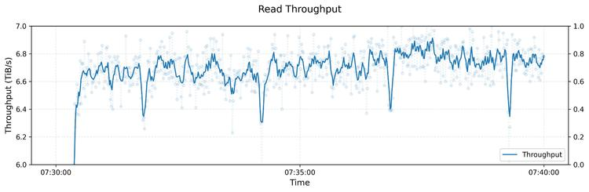
> 上图展示了大型 3FS 集群上读取压力测试的吞吐量。该集群由 180 个存储节点组成，每个节点配备 2×200Gbps InfiniBand 网卡和 16 个 14TiB NVMe SSD。大约使用了 500+ 个客户端节点进行读取压力测试，每个客户端节点配置了 1 个 200Gbps InfiniBand 网卡。最终的聚合读取吞吐量达到大约 6.6 TiB/s。


从中不难看出，3FS带来了强大的性能表现，6TiB级别的每秒吞吐量级可以大大提升大模型训练的速度。
### 2.2 Rust

#### 2.2.1 Rust概述

> Rust 是一门系统编程语言，专注于安全 ，尤其是并发安全，支持函数式和命令式以及泛型等编程范式的多范式语言。

Rust是一门为了解决并发和安全性（也包括并法中的安全性）系统问题的编程语言。相比于传统的C，C++等语言，Rust通过其本身的独特设计，尤其强调安全，内存控制和并发处理。

当下，C语言由于其简洁性尽管仍然受到大量轻度开发者的青睐，可在大型项目中，受制于C语言需要手动管理内存，容易造成内存泄漏等安全问题，Rust便可以在这方面保证极高的安全性。

#### 2.2.2 Rust & 3FS 的可能

根据Rust语言的特性：并发处理，安全保证

- 3FS基于分布式架构，使用异步I/O，Rust可以更好保证并发请求的处理
- 3FS大量源码使用C，C++编写，使用Rust改写可以增强其安全性，可用性

### 2.3 项目意义
#### 2.3.1 Rust改写FUSE的实际价值
+ Rust改写FUSE的主要优势：内存安全、性能优化、跨平台支持
+ FUSE：C语言编写，缺乏内存安全机制，容易导致野指针、空指针、缓冲区溢出等内存错误，这些错误可能导致文件系统崩溃或数据损坏。
  + Rust的优势：Rust通过其独特的借用检查器和所有权系统，确保在编译时消除内存安全问题。这使得使用Rust改写FUSE可以从根本上减少内存错误的风险，提高文件系统的稳定性和可靠性。
+ FUSE：作为用户空间文件系统实现，需要通过系统调用与内核进行通信，造成额外的开销。此外，C语言的静态类型和指针操作不够高效。
  + Rust的优势：Rust的零成本抽象和现代编译器优化使得其生成的机器码与C语言相当，甚至在某些情况下更高效。Rust的并发模型和轻量级线程（threads）可以更高效地处理I/O操作，减少系统调用的开销，从而提高文件系统的整体性能
+ FUSE：主要针对Linux系统，在其他系统上使用体验并不佳。
  + Rust的优势：Rust提供了一个统一的依赖管理工具（Cargo）和包管理仓库（Crates.io）。通过Cargo，开发者可以轻松管理项目依赖，并将代码编译到多种平台（如Windows、macOS、FreeBSD等），使得改写后的FUSE可以在多种操作系统上运行，提高了文件系统的跨平台支持能力。Rust的Cargo build –all-targets命令可以一次性为所有支持的平台（如Windows、macOS、Linux等）编译代码，而无需手动调整编译选项或配置文件。
#### 2.3.2 项目对于我们的意义
+ 一次学习rust语言并应用的机会:Rust作为一门新兴的系统级别的编程语言，它旨在解决C/C++等语言在系统级编程中常见的安全性和并发性等问题。
+ 大型项目的源码学习经历：学习大型项目的结构组织，代码规范性
+ 前沿项目的学习： 3FS（Fire-Flyer 文件系统）是当下最先进高效的大模型文件系统之一。选择改写3FS体系下的FUSE模块，需要阅读3FS的大部分源码，可以深入了解当前领先的大模型文件系统的底层逻辑和具体实现原理。
+ 操作系统的学习：在项目进展中会涉及学习操作系统的内核结构、调度机制、中断处理、安全模型、用户与组管理、文件权限和加密机制等

## 3. 研究目标与实际完成内容
### 3.1 原计划研究目标
+ 基础内容：在个人电脑上部署原生3FS和修改后3FS，每次改写后
在电脑上进行单元测试。最后进行总测试。
+ 进阶内容：向3FS中接入xFUSE
### 3.2 实际项目内容
+ 已完成：
  + 使用Rust语言完全改写了3FS，通过了所有单元测试
  + 租借阿里云服务器"ecs.g8i.4xlarge"和"ecs.i4.4xlarge"，成功部署原版3FS和改写后的3FS，并完成功能验证
+ 未完成：
  + 未能在个人PC上部署3FS，因为个人电脑的配置远远不足部署的最低配置
  + 未能接入xFUSE，一方面是因为xFUSE未开源，另一方面是因为团队成员均精力有限

## 4. 研究方法和技术路线
### 4.1 部署3FS:在阿里云服务器上部署的详细操作
#### 4.1.1 三种部署尝试
1. 个人PC + Docker部署：曾经有一周都在尝试个人电脑 + Docker模拟多节点部署，但是一直未能成功。后来发现是因为个人电脑配置远远达不到部署的最低标准，比如支持RDMA、NVMe等等
2. 云服务器 + Docker部署：实现大多数部署内容，但因为多服务器部署分工合作更快，选择了多服务器部署
3. 多台云服务器部署：成功实现，这是我们最终的选择
   1. reference1：[基于eRDMA实测DeepSeek开源的3FS_3fs编译-CSDN博客](https://blog.csdn.net/weixin_43778179/article/details/145995349)
   2. reference2：[DeepSeek 3FS部署最佳实践_3fs 部署-CSDN博客](https://blog.csdn.net/Franklin7B/article/details/146308170)
#### 4.1.2 创建实例并且生成基础镜像

首先需要创建编译实例用来构建3fs基础环境，此后的具体节点配置搭建在此编译环境所构成的基础上。

具体来说，使用阿里云ecs服务，申请一个ecs.g8i.4xlarge 的实例，在上面安装编译环境（3fs文档指定，使用apt 无法获取 apt-get 可以获取），rust工具，以及FoundationDB （下载太慢了，感觉下了两个小时）。

然后再将打包好的3fs文件（modified）clone下来，进行编译，之后就可以得到一个包含3fs的基础镜像（需要使用阿里云的镜像生成服务）。

##### 4.1.2.1 构建细节
1. 构建基础环境，具体的shell命令参考3fs github官网

2. 下载fuse，注意这一步可能会比较慢，稍加等待即可

3. 下载rust支持。这一步与我们在自己电脑环境上下载rust基本相同，参考流程如下
```bash
	export RUSTUP_DIST_SERVER=https://mirrors.ustc.edu.cn/rust-static 
	export RUSTUP_UPDATE_ROOT=https://mirrors.ustc.edu.cn/rust-static/rustup
	#然后使用官网上的下载curl指令
	source $HOME/.cargo/env
	#source之后重启shell使设置成立
```

4. 下载foundationdb，这一步会耗时很长，原因是github/apple的连接传输过慢，经常下载速度在10KIB/S以下，即使调高带宽，我的解决方法是在本地先下载foundaiondb的稳定版本（此时为ver 7.3.63），再通过阿里云的上传文件功能将deb包传输上去

5. 编译3fs，这一步是耗时最长的一步
``` bash
git clone https://github.com/deepseek-ai/3fs
cd 3fs
git submodule update --init --recursive
./patches/apply.sh
cmake -S . -B build -DCMAKE_CXX_COMPILER=clang++-14 -DCMAKE_C_COMPILER=clang-14 -DCMAKE_BUILD_TYPE=RelWithDebInfo -DCMAKE_EXPORT_COMPILE_COMMANDS=ON
cmake --build build -j
```
	这里可能有两个问题，第一个是cargo下载库较慢，另一个是编译过程中内存占用过高导致LINUX OOM kill，表现结果是编译进度卡死。第一个的解决方法是配置国内rust镜像源，第二个的解决方法是要么提高配置，要么降低编译时的并行数（-j参数），以我的例子来说，使用了ecs.g8i.16xlarge,并行数为4,这样是过于保守的做法，代价是编译速度缓慢。

6. 生成3fs编译镜像，这一步比较简单，直接使用阿里云平台上的创建自定义镜像即可（镜像是个好功能，可以多用用） 

#### 4.1.3 使用生成镜像进行各节点配置
在本测试中，使用1个meta节点，3个storage节点进行配置，其中很多功能共同运行在meta节点上，这里mgmtd和Fuse client也是运行在meta节点上

| nodeid | name     | monitor | admin client | mgmtd | meta | storage | fuse client |
| ------ | -------- | ------- | ------------ | ----- | ---- | ------- | ----------- |
| 1，100  | meta     | y       | y            | y     | y    | n       | y*          |
| 10001  | storage0 | n       | y            | n     | n    | y       | n           |
| 10002  | storage1 | n       | y            | n     | n    | y       | n           |
| 10003  | storage2 | n       | y            | n     | n    | y       | n           |
>Tips: 对于fuse client，可以搭载在meta node 上，用以进行简易测试，也可以在外部独立节点搭建，用以模拟高并发环境下的情况

##### 4.1.2.1 搭建meta节点
1. 将eRDMA模式改为1
```Bash
rmmod erdma
odprobe erdma compat_mode=1
```
2. 修改mxsge
```Bash
cd ~/3fs/configs
sed -i 's/max_sge = 16/max_sge = 1/g' `grep -rl max_sge`
```

3. 创建脚本，支持mellanox网卡

```Bash
#!/bin/bash
echo "erdma_0 port 1 ==> eth0 (Up)"
chmod +x /usr/sbin/ibdev2netdev
```

4. 将meta对应的ip填入每个节点的/etc/hosts，这一步用在以后的rsync操作中，用来简化meta节点的ip地址的填写，但在我们实际配置中，使用这个的操作可以用root@（实际IP地址），并且有关于ip的操作中，更加麻烦的是更改各种config中的ip地址以及端口

5. 安装clickhouse

6. 配置monitor服务在我们的配置过程中，有时会出现，启动失败的情况，报错core - dumped，但在我们执行了这段代码后，启动正常，*不过不排除启动需要时间，而我们在没有启动的时候就查看状态了*
```bash
rmmod erdma
odprobe erdma compat_mode=1
```

7. 配置Admin Client 服务
    这里需要添加一下关于rsync的说明，通常需要使用ssh进行连接，也就是说需要**第一22端口的开放，第二密钥中的公钥传递到~/.ssh/authorizedkeys中**。但是阿里云申请的ecs实例在ssh权限方面有问题，导致ssh相关操作会失败,经过比对，authorized_keys 中只有阿里云上自建的密钥对信息。这是源自sshd.config的问题，阿里云会将config中的大部分注释掉，需要手动进行改动设置，比如如下的比较重要的几个设置，其中最下面的图片中改为yes，可以使用ssh-copy-id 自动传递公钥，如果不改，需要手动将公钥写入authorized_keys 中。[参考](https://blog.csdn.net/yxyc666/article/details/142331896)

```Bash
# on server A
#如果希望使用meta代替ip地址，可能需要清除旧的痕迹
ssh-keygen -f "/root/.ssh/known_hosts" -R "meta"

#first
nano /etc/ssh/sshd_config

PubkeyAuthentication yes
AuthorizedKeysFile .ssh/authorized_keys .ssh/authorized_keys2
PasswordAuthentication yes

# 去控制台设置实例的密码

#then
systemctl restart sshd

# on client B
ssh-keygen -t rsa
ssh-copy-id root@$(ip_address)#meta节点的ip地址

#rsync .......
```

8. 配置mgmtd服务
        
        ```Bash
        cp ~/3fs/deploy/systemd/mgmtd_main.service /usr/lib/systemd/system
        ##cp 命令 做了对于system空间的更改，需要以下命令进行重载
        systemctl daemon-reload
        ## 
        如果未有warning提醒，并且没有使用上面的命令
        可能会出现fail
        ##
        反之，如果出现warning并且按照这样更改，那么就会成功
        ```
        事实上这只是一方面，另一方面是，阿里云的erdma需要每次都重新配置，需要
        
        ```Bash
        # 卸载
        rmmod erdma
        #重装 
        modprobe erdma compat_mode=1
        ```
    
9. 配置meta service
    
10. 配置3FS
		具体见参考链接
	1. 这里需要根据自己的ecs配置进行设置，以我们的存储是申请了3个节点，每个节点一个SSD盘（超级丐版），这里的num-nodes需要按照这样更改。
	2. 以下的两段代码是在分配物理存储的映射关系，与3fs使用的CR和CRAQ有关，target是最小的单元，

```bash
python3 ~/3fs/deploy/data_placement/src/model/data_placement.py \
  -ql -relax -type CR --num_nodes 3 --replication_factor 3 --min_targets_per_disk 1
```

```bash
 python3 ~/3fs/deploy/data_placement/src/setup/gen_chain_table.py \
   --chain_table_type CR --node_id_begin 10001 --node_id_end 10003 \ 
   --num_disks_per_node 1 --num_targets_per_disk 1 \
   --target_id_prefix 1 --chain_id_prefix 1 \
   --incidence_matrix_path output/DataPlacementModel-v_3-b_1-r_1-k_3-λ_1-lb_1-ub_0/incidence_matrix.pickle
```

以上均运行在/opt/3fs/下，或者说output会产生在当前目录下，只要能在后面的命令中找到就可以

出现未知错误，可能由于admin client功能莫名奇妙失去挂载（可能由于服务器停机）。也可能是因为storage 节点断开链接或者未成功链接导致target（到物理SSD的映射）（必须要保证已经建立的节点数和node id begin 到 node id end 相匹配）

### 4.2 Rust改写FUSE模块


#### 4.2.1 目录结构

1. C++ 原始实现（src/3fs_origin/src/fuse/）：
   - 主要是 .cc 和 .h 文件，典型如 FuseOps.cc/h, IoRing.cc/h, UserConfig.cc/h, PioV.cc/h, IovTable.cc/h 等。
   - 采用面向对象设计，类较多，依赖 C++ 标准库和第三方库（如 folly、fuse3、fmt 等）。
   - 代码量大，功能分散，接口复杂。

2. Rust 改写实现（src/3fs_rustfuse/src/fuse/src/）：
   - 主要是 .rs 文件，结构与 C++ 类似，如 FuseOps.rs, IoRing.rs, UserConfig.rs, PioV.rs, IovTable.rs 等。
   - 采用 Rust 的模块和 trait 体系，结构更清晰，类型安全。
   - 许多 C++ 的类和方法被转化为 Rust 的 struct、trait 和 impl。

3. Rust 兼容 C++ 的 glue 层（src/3fs_rustfuse/src/fuse/）：
   - 依然保留部分 .cc 和 .h 文件，作为与 C++ 生态与 FFI 交互的桥梁。
   - 例如 IoRing.h, UserConfig.h, PioV.h 等，内容与原始实现类似，但通常只保留接口声明或做简单适配。
   - 数据转换：Rust 和 C++ 的数据类型并不完全相同，
   - glue 层的作用：
     - 负责在两种语言之间进行数据类型的转换。例如，将 Rust 中的字符串转换为 C++ 可以识别的格式，或者将 C++ 中的复杂数据结构转换为 Rust 能够处理的形式。
     - 调用封装：封装 Rust 或 C++ 的函数调用，使其能够被另一种语言调用。这包括处理函数的参数传递、返回值处理以及异常处理等。例如，通过 glue 层，C++ 代码可以调用 Rust 中定义的函数，反之亦然。
     - 内存管理协调：Rust 和 C++ 有不同的内存管理机制，glue 层需要协调两种语言的内存分配和释放。例如，确保 Rust 分配的内存可以在 C++ 中安全地使用，并且在不需要时正确地释放。

#### 4.2.2 主要模块的迁移与重构
1. FUSE 操作层（FuseOps）
   - C++ ： FuseOps.cc/h 负责注册 FUSE 回调、处理请求、管理全局状态。
   - Rust：FuseOps.rs 实现了 fuser::Filesystem trait，所有 FUSE 回调（如 lookup, getattr, read, write 等）都以 Rust 方式实现，状态管理用 struct 和 HashMap 替代。
   - 迁移要点：
    > C++ 的全局单例、静态变量被 Rust 的 struct/impl 和所有权机制替代。
    > 错误处理从 C++ 的返回码和异常，转为 Rust 的 Result 和 ? 操作符。
    > 复杂的 C++ 继承体系被 Rust trait 和泛型替代。

2. IO 环（IoRing）
   - C++：IoRing.cc/h 负责 IO 环队列、信号量、并发处理等，底层用共享内存和原子操作。
   - Rust：IoRing.rs 用 tokio-uring、tokio::sync::Semaphore、Arc<Mutex> 等实现并发队列和异步 IO，接口更现代。
   - 迁移要点：
    > C++ 的裸指针、手动内存管理被 Rust 的智能指针和所有权模型替代。
    > 队列、信号量等并发原语用 Rust 标准库或 tokio 生态实现。
    > IO 操作变为 async/await 风格，易于扩展和测试。

3. 配置与用户管理（UserConfig, FuseConfig）
   - C++：UserConfig.cc/h, FuseConfig.h 负责配置项的管理、用户隔离、权限校验等。
   - Rust：UserConfig.rs, FuseConfig.rs 用 struct、trait、HashMap、Arc<Mutex> 实现配置管理，支持热更新和多用户隔离。
   - 迁移要点：
   > C++ 的复杂继承和模板被 Rust trait、泛型和 derive 宏简化。
   > 配置文件解析用 serde + toml/json，热更新用 trait 回调。
   > 用户隔离、权限校验逻辑更清晰，易于维护。

4. 分布式 IO（PioV, IovTable）
   - C++：PioV.cc/h, IovTable.cc/h 负责分布式 IO、chunk 管理、批量读写等。
   - Rust：PioV.rs, IovTable.rs 用 trait + async/await 实现批量 IO，chunk 逻辑用 struct 封装。
   - 迁移要点：
   > C++ 的回调和函数指针被 Rust 闭包和 async trait 替代。
   > 错误处理、资源回收更安全，易于并发扩展。
5. FuseClients - 核心客户端管理
   - C++: FuseClients.h/cc - 管理所有 FUSE 客户端、IO 环、配置等全局状态
   - Rust: FuseClients.rs - 用 Arc<Mutex> 管理共享状态，tokio 处理异步 IO
   - 迁移要点：
   > C++ 的全局单例 getFuseClientsInstance() 被 Rust 的 Arc<FuseClients> 替代
   > folly::MPMCQueue 被 tokio::sync::mpsc 替代
   > folly::Synchronized 被 Arc<Mutex> 替代
   > 协程池 CoroutinesPool 被 tokio::task::JoinHandle 替代

6. FuseMainLoop - 主循环入口
   - C++: FuseMainLoop.h/cc - 使用 fuse3 库的底层 API
   - Rust: FuseMainLoop.rs - 使用 fuser crate 的高级 API
   - 迁移要点：
   > C++ 的 fuse_session_new(), fuse_session_loop() 被 Rust 的 fuser::mount2() 替代
   > 命令行参数解析从 gflags 转为 Rust 的 std::env::args()
   > 信号处理从 C 回调转为 Rust 的 Drop trait

7. FuseConfigFetcher - 配置获取器
   - C++: FuseConfigFetcher.h/cc - 继承自 MgmtdClientFetcher
   - Rust: FuseConfigFetcher.rs - 独立的 struct，使用 async/await
   - 迁移要点：
   > C++ 的继承被 Rust 的组合替代
   > folly::coro::blockingWait 被 tokio::runtime::Runtime 替代
   > 错误处理从 Result<Void> 转为 Result<(), Box<dyn Error>>

8. hf3fs_fuse - 应用入口
   - C++: hf3fs_fuse.cpp - 支持两种模式：应用模式和库模式
   - Rust: hf3fs_fuse.rs - 简化的应用入口，主要逻辑在 main()
   - 迁移要点：
   > C++ 的条件编译 #ifdef ENABLE_FUSE_APPLICATION 被 Rust 的 feature flags 替代
   > gflags 参数解析被 Rust 的 clap 或手动解析替代
   > 资源管理从 SCOPE_EXIT 转为 Rust 的 RAII

9. FuseApplication - 应用框架
   - C++: FuseApplication.h/cc - 继承自 ApplicationBase
   - Rust: FuseApplication.rs - 实现 ApplicationBase trait
   - 迁移要点：
   > C++ 的虚函数被 Rust trait 替代
   > std::unique_ptr<Impl> 被 Rust 的 struct 内嵌替代
   > 生命周期管理更安全，无需手动内存管理

10. FuseAppConfig - 应用配置
    - C++: FuseAppConfig.h/cc - 使用宏定义配置项
    - Rust: FuseAppConfig.rs - 使用 struct 和 derive 宏
    - 迁移要点：
    > C++ 的 CONFIG_ITEM 宏被 Rust 的 struct 字段替代
    > 配置解析从 TOML 转为 serde + toml
    > 热更新机制用 trait 回调实现

11. FuseLauncherConfig - 启动器配置
    - C++: FuseLauncherConfig.h/cc - 启动相关配置
    - Rust: FuseLauncherConfig.rs - 对应的 Rust 实现
    - 迁移要点：
    > 配置结构保持一致，但实现方式更简洁
    > 错误处理更安全

12. ffi.rs - 外部接口
    - 新增: Rust 特有的 FFI 层，提供 C 接口供 C++ 代码调用
    - 功能：
    > 导出所有主要函数为 C 接口
    > 处理字符串转换和内存管理
    > 提供错误码映射
    - 迁移要点：
    >使用 #[no_mangle] 和 extern "C" 导出函数
    >用 CString 和 CStr 处理字符串转换
    >用 Box::into_raw 和 Box::from_raw 管理内存

13. lib.rs - 模块组织
    - 新增: Rust 的模块入口，组织所有子模块
    - 功能：
    > 声明所有子模块
    > 重新导出主要类型和函数
    > 提供统一的 API 接口

#### 4.2.3 迁移过程中的通用思路
- 接口对齐：每个 C++ 类/接口都在 Rust 中有对应的 struct/trait，方法名和参数尽量保持一致，便于迁移和测试。
- 功能拆分：C++ 中复杂的类被拆分为多个小模块，Rust 中每个文件/模块只负责单一功能。
现代化重构：利用 Rust 的 async/await、所有权、trait、宏等特性，简化代码、提升安全性和可维护性。
- 分层迁移：
> 应用层 → Rust (FuseApplication, hf3fs_fuse)
> 配置层 → Rust (FuseConfig, UserConfig)
> IO 层 → Rust (IoRing, PioV, IovTable)
> 核心层 → Rust (FuseOps, FuseClients)
> 兼容层 → 保留 C++ 接口
- FFI 兼容：保留部分 C++ 头文件和实现，作为与 C++ 生态或底层库交互的 glue 层，逐步减少依赖，确保与现有 C++ 代码的兼容性、逐步迁移的平滑过渡、关键部分的 C++ 实现保留
-  技术栈升级：
> 并发: folly → tokio
> 序列化: 自定义 → serde
> 错误处理: 返回码 → Result<T, E>
> 内存管理: 手动 → 所有权系统
> 异步: 协程 → async/await
- 架构改进：
> 模块化: 更清晰的模块边界
> 类型安全: 编译时检查
> 错误处理: 更安全的错误传播
> 并发安全: 更安全的共享状态管理

#### 4.2.4 常见错误及解决方案

##### 4.2.4.1 FFI 相关错误

1. C/C++ 与 Rust 类型不匹配

- Rust 和 C/C++ 的类型系统不同，常见如 `usize`/`isize` 与 `size_t`/`ssize_t`，`u8`/`i32` 与 `uint8_t`/`int32_t` 等不一致。

- 结构体对齐、填充、大小不一致，导致内存访问错误。

2. ABI（应用二进制接口）不一致

- Rust 端声明 `extern "C"`，但 C 端未用 `extern "C"` 导出，或者C端声明 `extern "C"` ，但Rust端未用 `extern "C"` 导入(最开始写 hf3fs_fuse_init 模块时就出现过)。

- 函数参数传递的顺序、返回值类型不一致（比如MultiPrioQueue方法传递的Key-Value）。
```
#[no_mangle]
pub extern "C" fn hf3fs_fuse_set_user_config(
    uid: u64,
    key: *const c_char,
    value: *const c_char,
) -> c_int
```

3. 链接错误

- Rust 代码调用 C/C++ 库，找不到对应的 `.so`/`.a` 文件，报 `undefined reference`。

- CMake/Cargo.toml 配置不正确，导致链接参数丢失。

4. FFI 安全性问题

- Rust 端传递了悬垂指针、未初始化内存、越界访问等，导致 C 端崩溃。

- C 端释放了 Rust 端分配的内存，导致 double free。

##### 4.2.4.2 Rust 文件改写时遇到的错误

1. trait/impl 不匹配

- 实现的 trait 方法签名与 trait 定义不一致。

- impl 块中类型参数、生命周期参数不匹配。

2. 所有权/借用错误

- 借用检查器报错，如"cannot borrow as mutable more than once at a time"。

- 生命周期不明确，导致"does not live long enough"错误。

3. 类型推断失败

- 类型不明确，编译器无法推断类型。

4. feature/gate 错误

- 用了 nightly feature，但没有加 `#![feature(...)]`。

- 依赖 crate 版本不兼容。

##### 4.2.4.3 混合编译整个 3fs 目录时的错误及解决方案

1. 依赖缺失

- 缺少 C/C++ 依赖库（如 leveldb、rocksdb、liburing 等）。

- Rust crate 依赖没有正确声明或版本冲突。

2. CMake/Cargo 配置错误

- CMakeLists.txt/Cargo.toml 配置不正确，导致找不到源文件的位置或者链接失败。

- build.rs 脚本出错，环境变量未设置。

3. 安全性错误

- unsafe 代码块未正确处理，导致运行时崩溃。

- 多线程/并发相关的竞态条件。

---

错误示例

- `error: linking with 'cc' failed: exit code: 1`

- `undefined reference to ''`

- `error[E0308]: mismatched types`

- `error[E0597]: borrowed value does not live long enough`

- `error: could not find native static library`

- `error: expected identifier, found keyword 'type'`

- `Segmentation fault (core dumped)`（运行时）

---

我们的对策

1. **先单独编译 FFI 相关的 C/C++ 代码**，确保无误。

2. **用 `cargo build -vv` 查看详细编译日志**，定位 Rust 端错误。

3. **检查 CMake/Cargo.toml 配置**，确认依赖和链接参数。

4. **用 `nm`/`objdump` 检查符号导出**，确认 ABI 一致。

5. **用 `RUST_BACKTRACE=1` 跑出错的二进制，获取详细堆栈信息**。

#### 4.2.5 Rust改写C类语言的总结
- 从 C++ 到 Rust 的迁移，不仅是语法的转换，更是架构和思想的升级。
- Rust 版本更安全、易维护、易扩展，适合现代分布式和高并发场景。
- 迁移过程中，建议逐步替换、分阶段测试，确保功能等价和性能提升。

## 5. 研究成果
### 5.1 部署结果
1. 部署节点信息：
   1. 一个meta（同时也是mgmtd和fuse client）:使用ecs.g8i.4xlarge
   2. 三个storage：使用ecs.i4.4xlarge（一个带有NVMe的SSD盘）
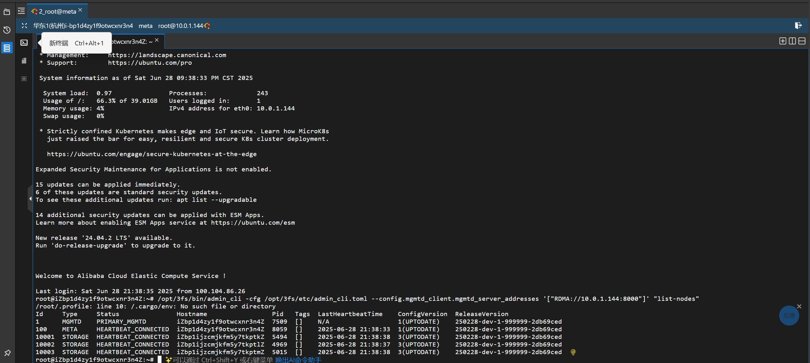
2. 链信息（CRAQ中的chian）
   1. 一条链
   2. 该链连接四个节点
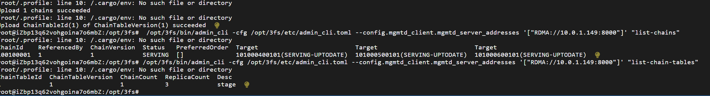
3. clickhouse运行统计信息
clickhouse是一个实时数据分析工具，3fs内置了clickhouse供我们调用查看运行时的部分统计信息
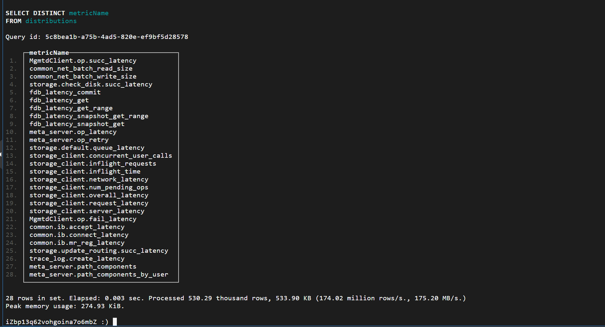
4. fio测试
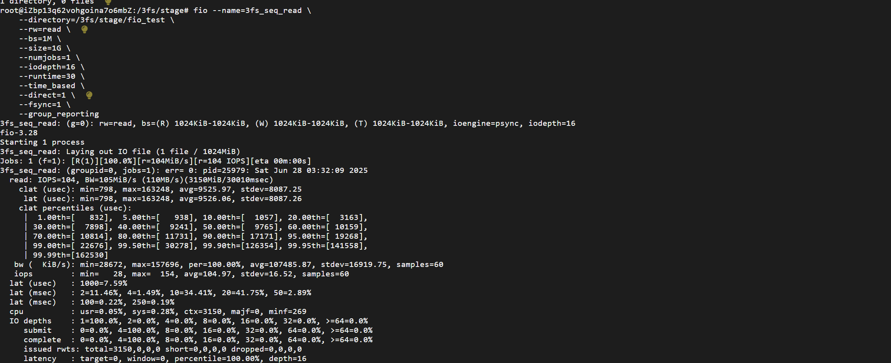
因为机器性能问题只能进行一个进程的测试，无法测试并发
5. 控制台性能信息
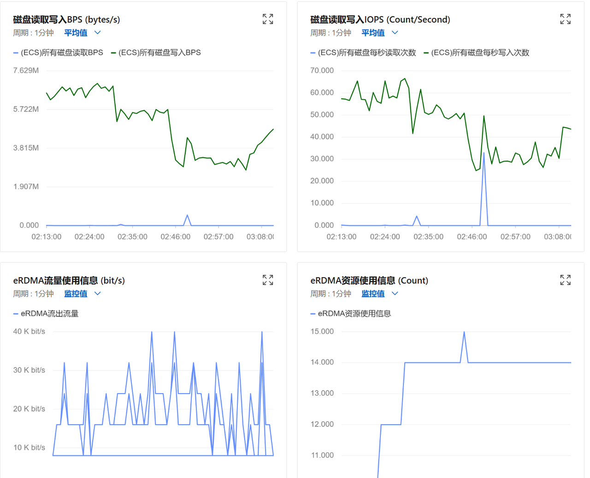

### 5.2 改写结果
1. 编译完全通过
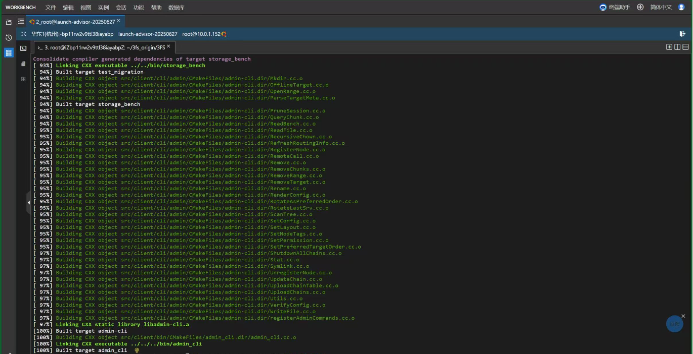
2. 3fs自带单元测试结果
   1. 原版3fs：通过278，失败36
   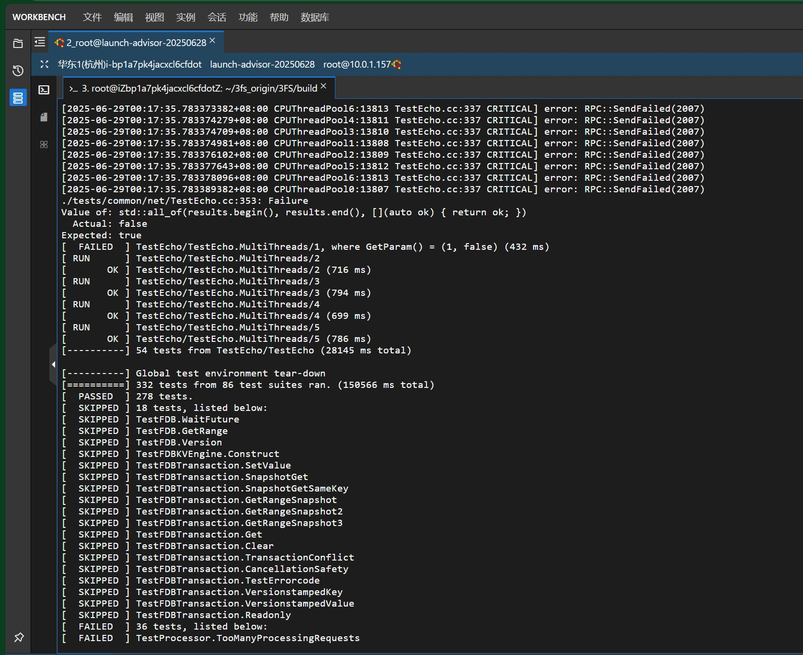
   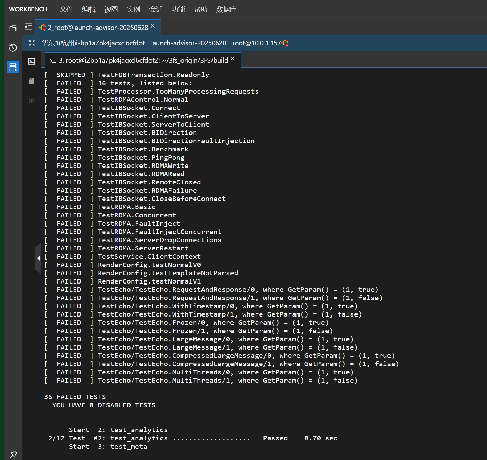
   2. 改写3fs：通过278，失败36
   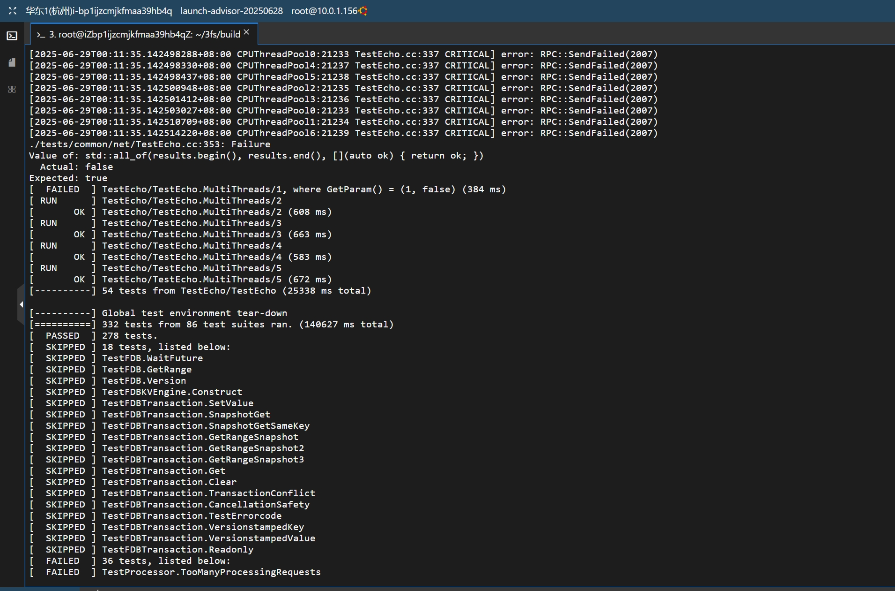
   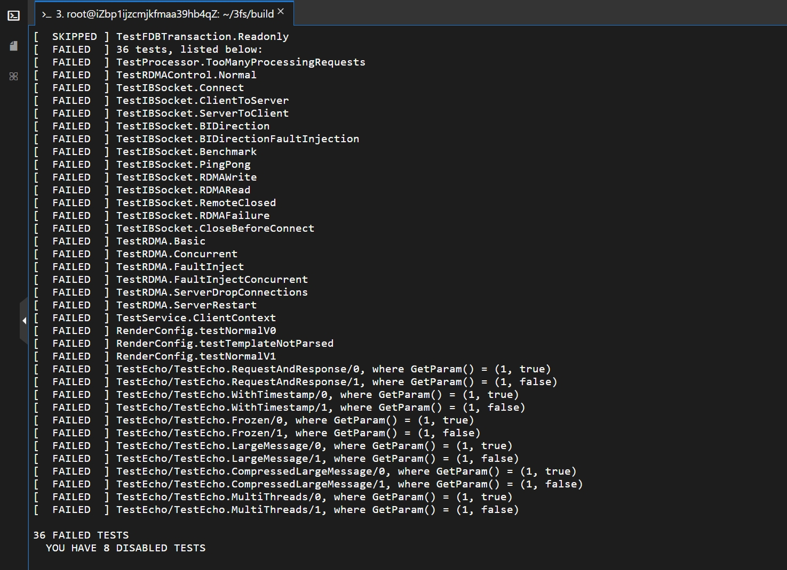
   以上说明我们的3fs功能和原版几乎是完全一致的，但是原版3fs也不能完全通过自己的单元测试，这很有趣
   我们猜想这个问题的原因可能是机器性能的问题，也可能是3FS自身的问题
3. 改写前后安全性测试结果
使用腾讯云代码分析比较改写前后安全性
   1. 原版测试结果
   
   2. 改写版本测试结果
   
   3. 比对结果显示改写后的版本比原版问题减少5个，并且减少了一个错误，并且通过对具体检查问题的详细比对，我们改写后的版本没有新增任何问题，考虑到FUSE模块只是3FS中的一小部分，我们的改写工作应当是有不小成效的！

### 5.3 项目价值

#### 5.3.1 **​技术能力提升与创新实践​**
本项目为团队成员提供了极具挑战性的技术实践机会。通过构建基于Rust的FUSE模块，我们深入掌握了文件系统底层原理、高性能I/O优化等核心系统编程知识。这种跨越语言边界（从传统C/C++到现代Rust）的系统级开发经验，显著提升了团队在并发编程、内存安全管理和系统性能调优等方面的工程能力。
此外，部署这样的复杂系统，也显著提升了团队成员的工程能力，扩展了团队成员的知识面和技能树。
#### 5.3.2 **​安全性与可靠性的实质性突破​**
借助Rust的所有权模型和类型系统，重构后的3FS在内存安全方面取得显著改进。静态分析工具（腾讯云代码检查）的检测结果表明，新实现成功削减了原系统中存在的潜在内存泄漏、数据竞争等安全隐患。这种从语言层面构建的安全保障机制，为关键基础设施软件提供了更可靠的运行基础。
#### 5.3.3 **​后续研究价值​**
遗憾的是我们受限于机器，没能进行性能验证，如果有合适的机会，我们团队非常乐意进行相关的性能验证

## 6. 不足与展望
### 6.1 改写版3FS的性能验证与提升
受限于3FS对机器的高要求，我们没能实现对改写3FS的性能验证和提升
### 6.2 自动化一键部署3FS
由于团队成员的精力问题，我们没有去实现一键部署，未来可以实现单服务器+Docker一键部署进行功能验证，或者多服务器一键脚本部署进行功能和性能验证
### 6.3 对更多模块进行Rust改写
我们在此次项目中仅实现了对FUSE模块的改写，并且相关测试表明改写后的3FS有不小的安全性提升。我们有理由推测，对更多模块进行Rust改写，尤其是对`usrbio`改写，能够给3FS带来更多提升！
### 6.4 对单元测试进一步验证
我们在对原版和改写的3FS进行单元测试时，发现均无法完全通过完整单元测试，并且错误的36个测试完全相同。这个问题可能是因为机器性能问题，也可能是3FS自身的问题，我们将联系官方管理员进一步解决此问题