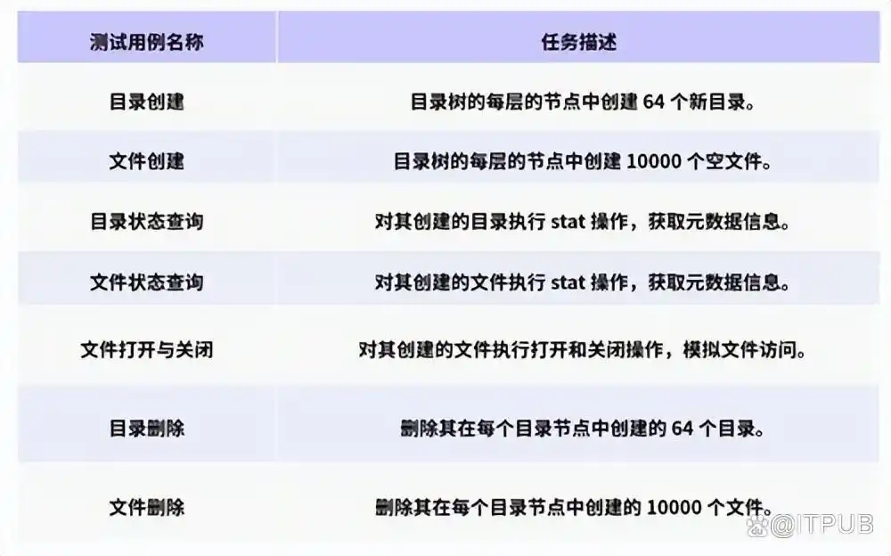
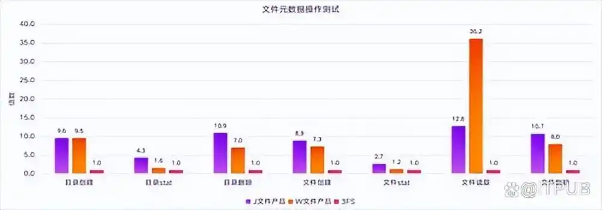
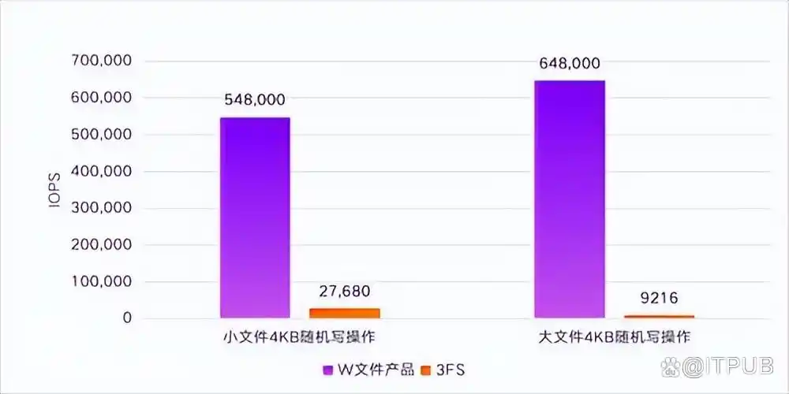
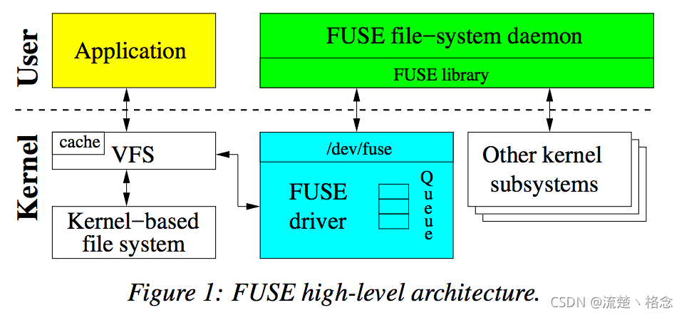
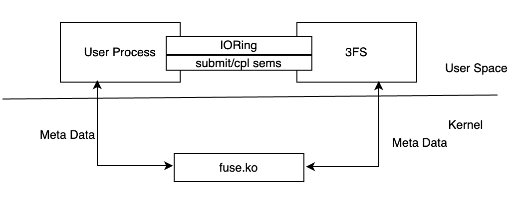
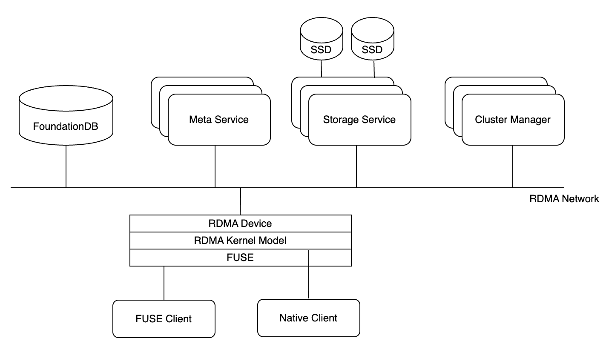
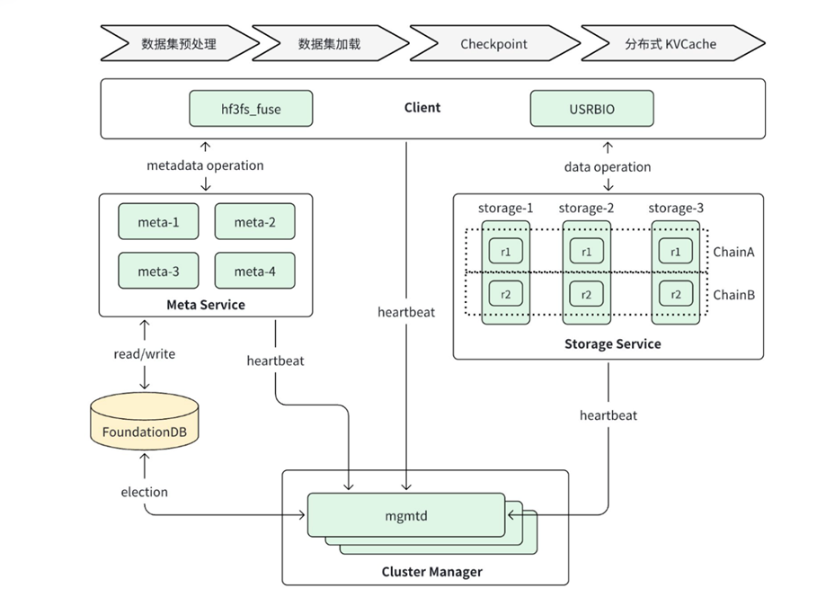

# Valor-Go 调研报告
## 目录
- [Valor-Go 调研报告](#valor-go-调研报告)
  - [目录](#目录)
  - [用Rust升级3FS中的FUSE模块](#用rust升级3fs中的fuse模块)
    - [团队成员](#团队成员)
    - [1. 项目概述](#1-项目概述)
    - [2. 项目背景](#2-项目背景)
      - [2.1 3FS文件系统](#21-3fs文件系统)
        - [3FS概述](#3fs概述)
        - [3FS技术特点](#3fs技术特点)
        - [3FS搭载表现](#3fs搭载表现)
      - [2.2 Rust](#22-rust)
        - [2.2.1 Rust概述](#221-rust概述)
        - [2.2.2 Rust \& 3FS 的可能](#222-rust--3fs-的可能)
    - [3. 立项依据](#3-立项依据)
      - [3.1 需求与挑战：3FS核心模块局限性/Rust语言优势​](#31-需求与挑战3fs核心模块局限性rust语言优势)
      - [3.2 FUSE接口局限与XFUSE的潜在优势](#32-fuse接口局限与xfuse的潜在优势)
      - [3.3 应用前景广阔](#33-应用前景广阔)
      - [3.4 技术可行性与团队提升](#34-技术可行性与团队提升)
    - [4. 前瞻性、重要性分析](#4-前瞻性重要性分析)
      - [4.1 一个好的文件系统对大模型的重要性：平衡性能与成本](#41-一个好的文件系统对大模型的重要性平衡性能与成本)
      - [4.2 关于3FS文件系统（Fire-Flyer File System）](#42-关于3fs文件系统fire-flyer-file-system)
      - [4.3 关于FUSE：用户空间文件系统](#43-关于fuse用户空间文件系统)
      - [4.4 FUSE之于3FS](#44-fuse之于3fs)
      - [4.5 优化FUSE的重要性](#45-优化fuse的重要性)
    - [5. 相关工作](#5-相关工作)
      - [5.1 设计初衷](#51-设计初衷)
      - [5.2 3FS与其他分布式系统的异同：](#52-3fs与其他分布式系统的异同)
        - [HDFS](#hdfs)
        - [Ceph](#ceph)
          - [Ceph简介](#ceph简介)
          - [Ceph特点](#ceph特点)
          - [Ceph核心组件及概念介绍](#ceph核心组件及概念介绍)
      - [5.3 3FS应用领域：smallpond](#53-3fs应用领域smallpond)
    - [6. 参考文献](#6-参考文献)
## 用Rust升级3FS中的FUSE模块
### 团队成员
**吕祖灿 杨奕麟 梁修宁 任壮壮 王淇辉**

### 1. 项目概述
本项目旨在使用Rust语言升级3FS中的FUSE模块，利用RUST语言的安全性和XFUSE相对于FUSE的性能提升，实现extended-3FS。在掌握操作系统相关知识同时，学习先进现代编程语言、了解科学前沿。
### 2. 项目背景
#### 2.1 3FS文件系统

##### 3FS概述

随着当下大模型以及其在各个领域的应用愈加火热，有关于如何提升大模型表现的探索也在快速发展。在日常训练的过程中，训练速度与推理速度是两大重要指标。训练速度牵涉到模型与数据的统合训练与多次的加载与迭代。推理速度则牵涉到推理流程以及相关状态的缓存与读取。当前，硬件设备带来的计算速度提高，包括云计算等多种新兴计算技术带来的计算资源统合，无疑促进了AI的井喷式发展，此时，若能够在AI训练的底层基石——数据进行结构性优化，即设计更加专一为AI训练场景服务的文件系统，那么对于大模型的表现将会又上一个台阶。对此，DeepSeek推出了自己的解答，3FS。

3FS，即Fire-Flyer File System，是DeepSeek开源的高性能分布式文件系统，专为AI训练和推理任务设计。这里的专为AI训练推理体现在3FS作为文件系统对于AI训练数据加载的极强表现和对于AI训练场景所需的任务优化。

##### 3FS技术特点

- 使用典型分布式架构，3FS通过搭建在大量SSD RDMA网络之上，并结合Direct I/O 技术，实现无缓存加载数据；
- 使用CRAQ技术，保证数据的强一致性，作为分布式架构稳固的正确性保证；
- 同时3FS本身的系统设计可以支持随机异步I/O，以此可以针对AI推理的负载进行优化。

|       |          推理的需求           |               3FS的特点               |
| :---: | :----------------------: | :--------------------------------: |
|  吞吐量  |         极高的I/O速度         |              并行分布式架构               |
|  随机性  |       随机读取文件（随机取样）       |        实现无缓存Direct I/O，支持随机        |
| 数据准确性 |         读写的正确一致性         | 使用链式复制CRAQ，强一致性保证分布式结构下训练数据高准确性的要求 |
| 推理速度  | [AI](http://4.ai/)负载工作优化 |    KVCache——大模型推理，并发随机I/O——数据加载    |
| 延伸与应用 |        接口使用易用与高效         |    FUSE & USRBIO 共同使用，双端保证易用与高效    |

##### 3FS搭载表现
完整性能表现报告参考[3FS Github页面](https://github.com/deepseek-ai/3FS "README.md")

> 上图展示了大型 3FS 集群上读取压力测试的吞吐量。该集群由 180 个存储节点组成，每个节点配备 2×200Gbps InfiniBand 网卡和 16 个 14TiB NVMe SSD。大约使用了 500+ 个客户端节点进行读取压力测试，每个客户端节点配置了 1 个 200Gbps InfiniBand 网卡。最终的聚合读取吞吐量达到大约 6.6 TiB/s。

从中不难看出，3FS带来了如此强大的性能表现，6TiB级别的每秒吞吐量级可以大大提升大模型训练的速度。
#### 2.2 Rust

##### 2.2.1 Rust概述

> Rust 是一门系统编程语言，专注于安全 ，尤其是并发安全，支持函数式和命令式以及泛型等编程范式的多范式语言。

Rust是一门为了解决并发和安全性（也包括并法中的安全性）系统问题的编程语言。相比于传统的C，C++等语言，Rust通过其本身的独特设计，尤其强调安全，内存控制和并发处理。

当下，C语言由于其简洁性尽管仍然受到大量轻度开发者的青睐，可在大型项目中，受制于C语言需要手动管理内存，容易造成内存泄漏等安全问题，Rust便可以在这方面保证极高的安全性。

##### 2.2.2 Rust & 3FS 的可能

根据Rust语言的特性：并发处理，安全保证

- 3FS基于分布式架构，使用异步I/O，Rust可以更好保证并发请求的处理
- 3FS大量源码使用C，C++编写，使用Rust改写可以增强其安全性，可用性
### 3. 立项依据

#### 3.1 需求与挑战：3FS核心模块局限性/Rust语言优势​

**3FS核心模块局限性**

**链式复制协议问题：** 3FS采用链式复制协议，这使得写入操作的时延增大。因为链式复制需要逐个节点进行数据复制，一旦链中的某个节点出现延迟或故障，就会影响整个写入过程的效率。虽然CRAQ协议改进后支持在任意节点读取，但写操作仍然需要等待脏块（即尚未同步到所有副本的数据块）更新完成，这无疑增加了写入的等待时间。这种写入性能瓶颈在高并发写入场景下尤为明显，限制了3FS在对写入性能要求较高的应用场景中的适用性。

**模拟场景示例分析**

**分布式数据库写入场景：** 高并发写入时，写入延迟高，在对写入性能要求较高的金融交易系统、股票交易系统等场景中，3FS无法满足低延迟、高吞吐量的要求，可能导致数据库事务处理能力受限、事务积压、系统崩溃或用户体验下降。

**大数据实时分析场景：** 数据采集模块在高并发写入时，数据可能在缓冲区积压，导致缓冲区溢出，数据丢失，且数据到达存储系统的延迟增加，分析模块无法及时获取最新数据，影响分析结果的实时性和准确性。在需要实时监控和预警的环境监测系统、工业生产监控系统等场景中，3FS无法满足对低延迟、高可靠性写入的要求，可能导致分析结果不准确或预警延迟。

**云计算环境中的虚拟机镜像存储场景：** 高并发写入时，虚拟机镜像创建时间从正常1分钟增加到5分钟甚至更长，虚拟机镜像更新可能超时或失败，导致数据不一致问题。在需要快速创建和更新虚拟机的云计算平台中，3FS无法满足高性能写入的要求，可能导致用户体验不佳、系统效率低下。

**FoundationDB的KV存储逻辑问题：** 3FS的设计文档明确建议用户通过FFRecord或其他开源数据格式合并小文件，因为系统并未针对传统文件系统的小文件读写进行深度优化，甚至出于对Deepseek的定向设计一定程度上牺牲了小文件读写性能。下面给出小文件操作实测数据。

首先在测试目录下创建深度为8、每层目录创建64个子目录的目录树。然后基于这个目录树执行以下测试用例：

把结果跟其他并行文件系统（J文件产品和W文件产品）进行对比，能够明显发现3FS在小文件场景性能不足。图中以3FS的各个元数据操作OPS测试结果为基准值。

在小文件写操作测试（4KB随机写），因为4KB比FileSize/ChunkSize小，属于局部更新数据，所以底层存储触发读改写，假如FileSize是16KB，则读写放大是8倍。假如FileSize比ChunkSize （1MB）大，那么读写放大是1280倍，这导致性能极其差。而且假如小文件的FileSize小于ChunkSize，则会有严重的存储空间浪费。

通过以上测试数据可以看到，3FS对于小文件场景和随机小块更新写入出现远低于行业 一流水平的性能结果。这是3FS为适配Deepseek做出的牺牲。

**安全性/稳定性待提升：** 3FS在安全性与稳定性方面存在改进空间。这可能体现在多个方面，例如其在面对复杂的网络环境、硬件故障或恶意攻击时，可能无法很好地保障数据的完整性和系统的持续稳定运行。这在当今数据价值日益凸显、安全要求极高的市场环境中是一个不可忽视的缺陷。

**Rust语言优势** 

**内存安全与并发优势：** Rust语言以其强大的内存安全特性而闻名。它通过所有权系统、生命周期等机制，在编译时就能检测出许多可能导致内存错误（如空指针引用、数据竞争等）的代码问题。这与3FS在安全性方面的需求相契合，能够有效弥补3FS在安全性上的不足。同时，Rust对并发编程提供了良好的支持，能够更好地利用现代多核处理器的性能，从而在一定程度上提升系统的整体性能，尤其是在高并发读写操作的场景下，有助于缓解3FS链式复制协议带来的写入时延问题。

**性能与安全性平衡：** Rust在追求内存安全的同时，并没有牺牲太多的性能。它生成的代码运行效率较高，接近于传统的C/C++语言。这种在性能与安全性之间取得良好平衡的特性，使其成为对3FS核心模块进行升级优化的理想选择之一，能够在提升安全性的同时，尽量减少对系统性能的负面影响。

**我们想做的就是通过使用Rust改写3FS核心模块内容，利用Rust在内存安全、高并发等方面的天然优势，弥补3FS在定向Deepseek设计时牺牲的小文件操作性能和高并发读写风险。**

#### 3.2 FUSE接口局限与XFUSE的潜在优势

**FUSE自身局限**

**内存复制开销：** 当3FS通过FUSE接口与用户空间交互时，存在内存复制的开销。这是因为FUSE需要在内核空间和用户空间之间频繁地进行数据拷贝，这不仅增加了系统的负担，还可能导致性能下降。尤其是在处理大量数据或高频率的文件操作时，这种内存复制开销会更加明显，从而影响系统的整体性能。

**多线程支持不足：** FUSE接口的原始多线程支持不足，这在多线程环境下可能会导致性能瓶颈。现代操作系统和应用程序通常会利用多线程来提高效率，但FUSE接口的这一缺陷限制了3FS在多线程场景下的性能表现。例如，在多用户同时访问文件系统或进行复杂的文件操作时，可能会出现线程阻塞、资源竞争等问题，进而影响用户体验和系统效率。

**XFUSE潜在优势**

**性能提升潜力：** XFUSE作为一种可能的替代方案，如果能够增加3FS对XFUSE的兼容性，有望提升性能。XFUSE可能在设计上对内存复制和多线程支持进行了优化，从而能够更好地满足3FS在高性能场景下的需求。通过减少内存复制开销和改善多线程支持，可以提高文件系统的响应速度和吞吐量，使得3FS在处理高并发文件操作时更加高效。

**适应现代应用架构：** 现代应用架构越来越依赖多线程和高效的内存管理来实现高性能。XFUSE的兼容性改进可以使3FS更好地适应这种趋势，从而在云计算、大数据处理等对性能要求较高的领域更具竞争力。这不仅有助于提升3FS的市场应用前景，还能够满足用户对高性能文件系统的需求。

**3FS与FUSE**

3FS采用FUSE接口，Fuse包含一个内核模块和一个用户空间守护进程（下文称fuse daemon）。内核模块加载时被注册成Linux虚拟文件系统的一个fuse文件系统驱动。此外，还注册了一个/dev/fuse的块设备。该块设备作为fuse daemon与内核通信的桥梁，fuse daemon通过/dev/fuse读取fuse request，处理后将reply写入/dev/fuse。

上图详细展示了fuse的构架。当application挂在fuse文件系统上，并且执行一些系统调用时，VFS会将这些操作路由至fuse driver，fuse driver创建了一个fuse request结构体，并把request保存在请求队列中。此时，执行操作的进程会被阻塞，同时fuse daemon通过读取/dev/fuse将request从内核队列中取出，并且提交操作到底层文件系统中(例如EXT4或F2FS)。当处理完请求后，fuse daemon会将reply写回/dev/fuse，fuse driver此时把requset标记为completed，最终唤醒用户进程。

3FS 的客户端不仅支持通过 FUSE 进行文件操作，还提供了一组 Native Client API，允许用户绕过 FUSE 直接访问数据。这些 API 的设计类似于 Linux AIO（异步 I/O），旨在避免使用 FUSE 时产生的数据拷贝，从而减少 I/O 延迟并降低内存带宽的占用。

**总的来说，3FS 的 FUSE 客户端实现了文件和目录的基本操作，尽管通过API实现零拷贝减少数据拷贝带来的性能损失，但很多例如 JuiceFS 的 FUSE 客户端功能相比都更加全面。所以，我们希望能拓展3FS对XFUSE接口的支持，减少原FUSE的内存复制开销和多线程优化，进一步适配3FS在零拷贝技术方面的突破。**

#### 3.3 应用前景广阔

预期升级后的3FS系统将能够更好地满足市场对高性能、高可用性文件系统的需求，具有广阔的市场应用前景。
​
边缘计算需要低延迟/高分布式计算能力，升级后有望优化3FS的小文件操作和高并发写延迟，使3FS更好地适配边缘计算方面的应用。​

物联网需要对数据的快速访问与完整传输，升级后Rust语言的天然安全性搭配3FS的读取能力和强一致性正适配这些要求。

#### 3.4 技术可行性与团队提升

**技术可行性**

**初步研究基础：** 对现有系统的初步理解是开展后续工作的前提条件。我们已经初步了解了3FS文件系统结构，为后续的升级优化工作奠定了基础。我们对3FS的核心架构和关键模块有了基本的认识，能够初步判断哪些部分存在优化空间，以及如何进行改进。

**Rust语言学习与结合性研究：** 我们初步学习了Rust语言，并调查了3FS与Rust之间的可结合性，尝试将Rust语言的优势应用到3FS的升级中。

**性能提升预期：** 基于现有的研究和分析，我们初步判断在升级核心模块后（如XFUSE接口，Rust改写）会得到一定的性能提升。从上文的分析来看，3FS的核心模块和接口确实存在一些局限性，而Rust语言和XFUSE接口的引入有望解决这些问题。虽然具体的性能提升幅度还需要通过实际的测试和验证来确定，这对于我们这种小团队来说存在极大难度，但这种预期为项目的立项提供了信心。

**团队提升**
**操作系统课程学习与实践：** 我们希望通过参与3FS的升级项目，提升对操作系统课程的理解和掌握。通过对3FS这一实际系统的深入研究和改进，将理论知识与实践相结合，加深对操作系统原理、文件系统设计等方面的理解，从而在知识的理解与应用中得到提升。

**团队技术能力拓展：** 参与这样的项目可以帮助我们拓展技术能力，提高我们对新兴技术（如Rust语言、3FS）的了解、对复杂系统的优化能力以及团队协作和项目管理能力等。这不仅有助于我们每个人的职业发展，也能够提升整个团队在相关领域的竞争力，为未来承担更多类似的项目奠定基础。
### 4. 前瞻性、重要性分析
#### 4.1 一个好的文件系统对大模型的重要性：平衡性能与成本
**1.高效的大数据存储与访问**

（1）大规模数据存储：大模型通常需要大量的训练数据（如图片、文本、音频等），这些数据需要高效地存储和管理。文件系统为模型提供了可靠的数据存储方案，确保数据能够在模型训练过程中高效、安全地访问。

（2）快速读取与写入：大模型训练过程中需要频繁读取和写入数据，尤其是在数据加载、模型参数保存等方面。文件系统能够通过优化存取速度和减少延迟来保证训练过程的流畅性。

**2.支持并行计算和分布式训练**

（1）分布式存储：大模型往往需要在多个节点上分布式训练，文件系统可以管理不同节点之间的数据同步与共享。通过分布式文件系统（如HDFS、Ceph等），能够高效地存储和访问跨节点的数据，支持大规模并行计算。

（2）数据并行处理：文件系统能够帮助管理多个计算节点上的数据，使得训练过程能够并行化，提高效率，缩短训练时间。

**3.高效的持久化和恢复机制**

（1）模型持久化：在模型训练过程中，文件系统负责将训练过程中的模型参数和中间结果进行持久化存储，以便模型训练可以在中断后恢复。通过文件系统的存储机制，能够实现训练过程的断点恢复，避免数据丢失和重复计算。

（2）高容错性和备份：在进行大规模分布式训练时，文件系统提供的数据冗余和备份机制，保障了数据的安全性，即使某一部分数据丢失或损坏，也能恢复训练进度。

**4.优化存储与内存管理**

（1）数据预处理与缓存：大模型训练前需要大量数据预处理，文件系统支持对预处理数据进行有效缓存，以减少重复计算。在训练过程中，文件系统能够将频繁访问的数据缓存到内存或更快的存储介质中，提高数据加载速度。

（2）数据压缩与存储效率：大模型训练涉及的海量数据需要高效存储，文件系统可以通过数据压缩等方式减少存储空间消耗，降低存储成本

**5.文件系统的扩展性和多设备上的兼容性**

（1）水平扩展能力：随着大模型规模的增长，对数据的存储和处理要求也越来越高。现代文件系统支持横向扩展，可以通过增加存储节点和计算资源，动态调整存储能力，以满足大模型训练过程中的不断增长的需求。

（2）多层次存储：大模型训练中可能涉及不同类型的存储设备（如SSD、HDD、云存储等），文件系统支持这些不同类型存储的整合和优化。文件系统能够根据数据访问的频繁程度，选择合适的存储介质，以提高整体性能。

（3）与AI工具（如深度学习框架）的兼容：现代文件系统通常能够与主流的深度学习框架（如TensorFlow、PyTorch等）兼容，支持数据的高效流动和存取，确保训练过程的高效性和稳定性。

**对于我们的研究对象DeepSeek模型，具有显著优势：纯强化学习驱动的推理能力、混合专家模型（MoE）架构和超低成本训练。那么其背后的重要文件系统3FS的工作原理及其特性？如何能对其再进行进一步优化？**

#### 4.2 关于3FS文件系统（Fire-Flyer File System）

3FS是DeepSeekAI所使用的高性能分布式并行文件系统

提供高效的数据存储和访问支持,优化数据的存储布局和读写路径，在其基础上DeepSeek模型得以实现大规模数据处理和高效推理能力

3FS文件系统的构建运用FUSE作为底层的实现模块

#### 4.3 关于FUSE：用户空间文件系统
解决需求：将内核下定制开发文件系统转移到在用户空间下定制实现文件系统

优势：内核下定制开发文件系统难度较高，而用户空间下调试工具丰富，出问题不会导致系统崩溃，开发难度相对较低，开发周期较短。

**通过fuse内核模块的支持，开发者只需要根据fuse提供的接口实现具体的文件操作就可以实现一个文件系统**

#### 4.4 FUSE之于3FS
Fuse模块主要应用在3FS的客户端（用户模块）：hf3fs_fuse

操作实现由内核空间转到用户空间中：灵活性和易用性

允许定义自定义的行为和功能：数据存储策略、访问控制、同步策略等

#### 4.5 优化FUSE的重要性
**优化空间很大**

**1.大量的性能损失：** 

用户态-内核态切换，元数据操作延迟，并发与随机访问，用户空间系统间的信息传递等过程中产生大量性能损失

**2.安全性：** 

原始版本和3FS内版本主要由C/C++完成，会存在内存泄漏、缓冲区溢出等问题，语言安全性不高

**优化方向**

考虑优化3FS内的FUSE组件，参考XFUSE、RFUSE等（采用splice、多线程、writeback cache等方法），在一定程度上提升性能

Rust改写FUSE内部核心代码，解决安全性问题

### 5. 相关工作
#### 5.1 设计初衷
在当今数据驱动的时代，文件系统的性能和效率成为了衡量一个技术项目成功与否的关键指标之一。DeepSeek项目第五天的开源信息披露中，3FS并行文件系统的发布无疑为这一领域注入了一股强大的力量。3FS并行文件系统不仅仅是一个技术上的突破，更是对传统文件处理方式的一次深刻变革。

3FS并行文件系统的设计初衷是为了应对大规模数据存储和处理的需求。它采用了分布式架构，将数据分散存储在多个节点上，从而实现了高并发读写操作。这种设计不仅提高了系统的容错性，还极大地提升了数据访问的速度和效率。具体来说，3FS通过智能调度算法，能够根据各个节点的负载情况动态分配任务，确保整个系统的资源得到最优化利用。

此外，3FS并行文件系统还具备高度可扩展性。随着数据量的增长，用户可以通过简单地增加新的存储节点来扩展系统的容量，而无需对现有架构进行大规模改造。这种灵活性使得3FS能够在不同规模的应用场景中发挥出色的表现，无论是小型企业还是大型数据中心，都能从中受益。

值得一提的是，3FS并行文件系统在安全性方面也做了诸多改进。它支持多种加密协议，确保数据在传输和存储过程中的安全性。同时，系统内置了完善的权限管理机制，能够精确控制用户对文件的访问权限，有效防止未经授权的操作。[1]
#### 5.2 3FS与其他分布式系统的异同：
##### HDFS
HDFS是一个易于扩展的分布式文件系统，运行在成百上千台低成本的机器上。它与现有的分布式文件系统有许多相似之处，都是用来存储数据的系统工具，而区别于HDFS具有高度容错能力，旨在部署在低成本机器上。HDFS主要用于对海量文件信息进行存储和管理，也就是解决大数据文件（如TB乃至PB级）的存储问题。
HDFS采用主从架构（Master/Slave架构）。
HDFS集群是由一个NameNode和多个 DataNode组成。
HDFS提供 SecondaryNameNode 辅助 NameNode。[2]
**NameNode（名称节点）**
NameNode是HDFS集群的主服务器，通常称为名称节点或者主节点。一旦NameNode关闭，就无法访问Hadoop集群。NameNode主要以元数据的形式进行管理和存储，用于维护文件系统名称并管理客户端对文件的访问；NameNode记录对文件系统名称空间或其属性的任何更改操作；HDFS负责整个数据集群的管理，并且在配置文件中可以设置备份数量，这些信息都由NameNode存储。

**DataNode（数据节点）**
DataNode是HDFS集群中的从服务器，通常称为数据节点。文件系统存储文件的方式是将文件切分成多个数据块，这些数据块实际上是存储在DataNode节点中的，因此DataNode机器需要配置大量磁盘空间。它与NameNode通过心跳监测机制保持不断的通信，DataNode在客户端或者NameNode的调度下，存储并检索数据块，对数据块进行创建、删除等操作，并且定期向NameNode发送所存储的数据块列表。
**SecondaryNameNode（辅助节点）**
SecondaryNameNode是HDFS集群中的辅助节点。定期从NameNode拷贝FsImage文件并合并Edits文件，将合并结果发送给NameNode。SecondaryNameNode和NameNode保存的FsImage和Edits文件相同，可以作为NameNode的冷备份，它的目的是帮助 NameNode合并编辑日志，减少NameNode启动时间。当NameNode宕机无法使用时，可以通过手动操作将SecondaryNameNode切换为NameNode。
**Block（数据块）**
每个磁盘都有默认的数据块大小，这是磁盘进行数据读/写的最小单位，HDFS同样也有块的概念，它是抽象的块，而非整个文件作为存储单元，在Hadoop3.x版本下，默认大小是128M，且备份3份，每个块尽可能地存储于不同的DataNode中。按块存储的好处主要是屏蔽了文件的大小，提供数据的容错性和可用性。
**Rack（机架）**
Rack是用来存放部署Hadoop集群服务器的机架，不同机架之间的节点通过交换机通信，HDFS通过机架感知策略，使NameNode能够确定每个DataNode所属的机架ID，使用副本存放策略，来改进数据的可靠性、可用性和网络带宽的利用率。
**Metadata（元数据）**
在 NameNode 内部是以元数据的形式，维护着两个文件，分别是FsImage 镜像文件和 EditLog 日志文件。其中，FsImage镜像文件用于存储整个文件系统命名空间的信息，EditLog日志文件用于持久化记录文件系统元数据发生的变化。
当 NameNode启动的时候，FsImage 镜像文件就会被加载到内存中，然后对内存里的数据执行记录的操作，以确保内存所保留的数据处于最新的状态，这样就加快了元数据的读取和更新操作，但是这些操作非常消耗NameNode资源。于是HDFS文件系统引入了 EditLog 日志文件，该文件以追加方式记录内存中元数据的每一次变化，如果NameNode宕机，可以通过合并FsImage文件和Edits文件的方式恢复内存中存储的元数据。[3]
##### Ceph
###### Ceph简介
Ceph是一个统一的分布式存储系统，设计初衷是提供较好的性能、可靠性和可扩展性。
Ceph项目最早起源于Sage就读博士期间的工作（最早的成果于2004年发表），并随后贡献给开源社区。
在经过了数年的发展之后，目前已得到众多云计算厂商的支持并被广泛应用。
RedHat及OpenStack都可与Ceph整合以支持虚拟机镜像的后端存储。
###### Ceph特点
**高性能**
- 摒弃了传统的集中式存储元数据寻址的方案，采用CRUSH算法，数据分布均衡，并行度高。
- 考虑了容灾域的隔离，能够实现各类负载的副本放置规则，例如跨机房、机架感知等。
- 能够支持上千个存储节点的规模，支持TB到PB级的数据。

**高可用性**
- 副本数可以灵活控制。
- 支持故障域分隔，数据强一致性。
- 多种故障场景自动进行修复自愈。
- 没有单点故障，自动管理。

**高可扩展性**
- 去中心化。
- 扩展灵活。
- 随着节点增加而线性增长。

**特性丰富**
- 支持三种存储接口：块存储、文件存储、对象存储。
- 支持自定义接口，支持多种语言驱动。
###### Ceph核心组件及概念介绍
1. Monitor
一个Ceph集群需要多个Monitor组成的小集群，它们通过Paxos同步数据，用来保存OSD的元数据。

2. OSD
OSD全称Object Storage Device，也就是负责响应客户端请求返回具体数据的进程。一个Ceph集群一般都有很多个OSD。

3. MDS
MDS全称Ceph Metadata Server，是CephFS服务依赖的元数据服务。

4. Object
Ceph最底层的存储单元是Object对象，每个Object包含元数据和原始数据。

5. PG
PG全称Placement Grouops，是一个逻辑的概念，一个PG包含多个OSD。引入PG这一层其实是为了更好的分配数据和定位数据。

6. RADOS
RADOS全称Reliable Autonomic Distributed Object Store，是Ceph集群的精华，用户实现数据分配、Failover等集群操作。
7. Libradio
Librados是Rados提供库，因为RADOS是协议很难直接访问，因此上层的RBD、RGW和CephFS都是通过librados访问的，目前提供PHP、Ruby、Java、Python、C和C++支持。

8. CRUSH
CRUSH是Ceph使用的数据分布算法，类似一致性哈希，让数据分配到预期的地方。

9. RBD
RBD全称RADOS block device，是Ceph对外提供的块设备服务。

10. RGW
RGW全称RADOS gateway，是Ceph对外提供的对象存储服务，接口与S3和Swift兼容。

11. CephFS
CephFS全称Ceph File System，是Ceph对外提供的文件系统服务。

12. Pool：存储池，是存储对象的逻辑分区，它规定了数据冗余的类型和对应的副本
分布策略；支持两种类型：副本（replicated）和 纠删码（Erasure Code）
 一个Pool里有很多PG；
 一个PG里包含一堆对象；一个对象只能属于一个PG；
 PG属于多个OSD，分布在不同的OSD上[4]
#### 5.3 3FS应用领域：smallpond
1. Smallpond 是什么？
**(1) 定义**
Smallpond 是一个专为大规模 AI 训练设计的高性能、分布式数据加载和预处理框架。它由上海交通大学 IPADS 实验室开发，旨在解决 AI 训练中数据 I/O 瓶颈问题，特别是与 3FS 文件系统结合使用时，能够显著提升数据加载和预处理的效率。Smallpond 的设计理念是“小数据池”（small pond），通过将大规模数据集划分为多个小数据块（chunks），并利用分布式缓存和并行处理技术，实现高效的数据访问和预处理。
**(2) 核心功能**
- 分布式数据加载：Smallpond 支持从 3FS 等分布式文件系统高效加载数据，将数据分块并分发到多个计算节点。
- 并行数据预处理：Smallpond 可以在多个计算节点上并行执行数据预处理操作，如图像增强、文本编码、特征提取等。
- 分布式缓存：Smallpond 内置分布式缓存机制，可以将常用的数据块缓存在内存或 SSD 中，减少重复 I/O 操作。
- 数据流水线：Smallpond 支持构建数据流水线，将数据加载、预处理、缓存等操作组合成一个高效的工作流。
- 与 3FS 集成：Smallpond 针对 3FS 文件系统进行了优化，能够充分利用 3FS 的高性能和高可扩展性。
- 易用性：Smallpond 提供了简洁易用的 API，方便用户定义和管理数据加载和预处理流程。[5]
-  Smallpond + 3FS 实际应用案例
**DeepSeek-AI 大规模模型训练**
- 实现：DeepSeek-AI 使用 3FS 作为底层存储系统，Smallpond 作为数据加载和预处理框架。
- 流程：
Smallpond 从 3FS 读取训练数据，将数据分块并分发到多个计算节点。
在每个节点上，Smallpond 并行执行数据预处理操作，如文本分词、编码、填充等。
预处理后的数据被送入 AI 模型进行训练。
Smallpond 的分布式缓存机制缓存常用的数据块，减少重复 I/O 操作。
- 效果：
- 性能提升：Smallpond 与 3FS 的结合显著提升了数据加载和预处理的效率，缩短了模型训练周期。
- 扩展性优势：Smallpond 和 3FS 的高可扩展性使得 DeepSeek-AI 能够轻松扩展到数千个节点，支持更大规模的模型训练。
- 资源利用率提高：Smallpond 的并行处理和缓存机制提高了计算资源和存储资源的利用率。

### 6. 参考文献
1. https://github.com/deepseek-ai/3FS 3FS GitHub源码
2. https://baike.baidu.com/item/Rust%E8%AF%AD%E8%A8%80/9502634 Rust语言
3. https://cloud.tencent.com/developer/article/2507444 AI训练存储方案选谁？DeepSeek 3FS与JuiceFS的全面对比 2025.3.24
4. https://baijiahao.baidu.com/s?id=1825807801365317075 XSKY 实测 DeepSeek 3FS：小文件写性能让步，成就极致吞吐量 2025.3.6
5. https://www.xsky.com/about/news/info/id/934.html 实测 DeepSeek 3FS：我们拆解了性能怪兽的暴力美学 2025.3.5
6. https://developer.volcengine.com/articles/7480397583173877797 DeepSeek 3FS 架构分析和思考 2025.3.11
7. https://zhuanlan.zhihu.com/p/26982661774 DeepSeek Fire-Flyer File System(3FS) 2025.2.28
8. https://blog.csdn.net/Xs_20240309/article/details/145936389
9. https://blog.csdn.net/972301/article/details/145983604
10. https://blog.csdn.net/HinsCoder/article/details/136440714
11. https://blog.csdn.net/m0_58833554/article/details/134604853
12. https://blog.csdn.net/972301/article/details/145983604
13. https://zhuanlan.zhihu.com/p/27317616324 DeepSeek：3FS系统介绍
14. https://juicefs.com/zh-cn/blog/engineering/deepseek-3fs-vs-juicefs#01-%E6%9E%B6%E6%9E%84%E5%AF%B9%E6%AF%94 DeepSeek 3FS 与 JuiceFS：架构与特性比较
15. https://zhuanlan.zhihu.com/p/675783819 分布式文件存储基座Fuse的深度解析
16. https://zhuanlan.zhihu.com/p/671680806 XFUSE: An Infrastructure for Running Filesystem Services in User Space
17. https://yebd1h.smartapps.cn/pages/blog/index?blogId=145990796&_swebfr=1&_swebFromHost=baiduboxapp 数据处理框架Smallpond
18. https://zhuanlan.zhihu.com/p/26964619693 关键特点与架构（分布式SSD、RDMA），KVCache
19. https://deepseek.csdn.net/67d3a72d3b685529b70ad733.html 架构分析与性能测试
20. https://blog.csdn.net/MnivL/article/details/145940538 性能测试实例 
21. https://zhuanlan.zhihu.com/p/106719192 5分钟搞懂用户空间文件系统FUSE工作原理
22. https://blog.csdn.net/weixin_45525272/article/details/121298434 FUSE文件系统介绍
23. https://cloud.tencent.com/developer/article/1006138 吴锦华 / 明鑫 : 用户态文件系统 ( FUSE ) 框架分析和实战
24. https://cloud.tencent.com/developer/article/1766726 FUSE 用户空间文件系统 （Filesystem in Userspace）:代码实现了一个简单的 FUSE (Filesystem in Userspace) 文件系统，名为 "hello" 文件系统。
25. https://zhuanlan.zhihu.com/p/27571661405 一篇容器化部署博客
26. https://blog.csdn.net/qq871325148/article/details/145952486#:~:text=3FS 部分源码解析博客
