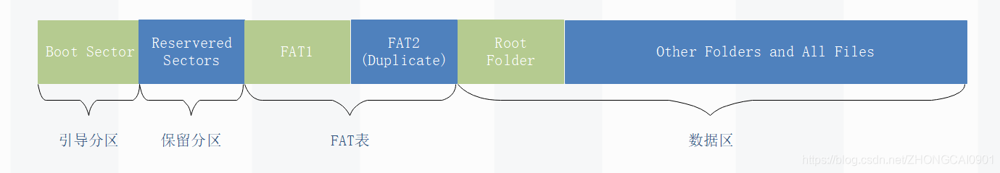

# FAT32文件系统调研（简单概述）
## PB23111729 吕祖灿

此文档省略了很多细节，仅仅对要求的基本知识（宏观概念）略作描述
有关FAT32中的具体细节参考https://blog.csdn.net/ZHONGCAI0901/article/details/115196445

## FAT文件系统概述
FAT(File Allocation Table，文件分配表)是微软于1977年设计的一种文件系统，最初用于软盘和小容量设备。

核心思想是通过**链式分配**管理文件存储，具有**简单、兼容性强**的特点

FAT包括FAT12、FAT16、FAT32,逐渐演进以支持更大的存储容量。

## 块/簇和卷的概念
1. 硬盘基本知识(盘片、磁头、磁道、扇区、柱面)：参考https://blog.csdn.net/ZHONGCAI0901/article/details/115196445
2. 磁盘块/簇：
   1. 虚拟出来的概念、逻辑上的定义，多个扇区组合成一个块/簇
   2. 扇区是物理上的概念，是物理擦除/读写的最小单位；块/簇是操作系统中最小的逻辑存储单位，每个块/簇可以包含$2^n$个扇区
3. FAT中引入卷的概念，将一个物理磁盘分成四个逻辑磁盘，每个逻辑磁盘称为卷（也就是分区），每个卷都是一个能够被单独格式化和使用的逻辑单元，以便文件系统分配空间时使用。每个卷都专门划出一个单独区域存放自己的目录和FAT表

## FAT卷的组织架构

这个图其实应该有问题，保留扇区包含了引导扇区
+ Boot Sector:引导扇区，包含BIOS参数块，该参数块存储有关卷布局和文件系统结构的信息，以及加载Windows 的引导代码。
+ Reserved Sectors:保留扇区：在第一个FAT开始之前的扇区数量，包括引导扇区。
+ FAT1:原始FAT表（可以简单理解FAT表为目录表，记录数据存储的位置。）
+ FAT2（Duplicate）:FAT表的备份（为了防止原始FAT表被破坏后可以恢复）
+ Root folder:描述根目录分区中的文件和文件夹。
+ Other folders and all files:包含文件系统中文件和文件夹的数据。

## FAT32根目录
+ 短文件格式
+ 长文件格式
这俩反正就是文件/目录在磁盘中存储的时候有特定的格式
在这些格式中包含的信息有：
  + 文件名称和属性
  + 文件创建日期和具体时间
  + 文件起始簇号

上面这些信息可以分别根据格式解析出来

## FAT32 FAT表
+ FAT表工作的原理：当存储了一个大的文件时，会以簇为单位，将文件拆分为多个簇存放在磁盘中，但是它们存放的簇号不一定是连续的（也就是不一定连续存放），所以用一个叫做FAT表（File allocate table）的东西，来将该文件用到的簇号串联起来（类似于链表）

1. 南京大学os2022课程（其中有对xv6和FAT的讲解，还没看）：https://jyywiki.cn/OS/2022/index.html
2. FAT32文件系统讲解（包含一些文件系统基础知识铺垫）：https://blog.csdn.net/ZHONGCAI0901/article/details/115196445
3. xv6-riscv(最新版)仓库：https://github.com/mit-pdos/xv6-riscv
4. Rust改写xv6 + 集成FAT32的几个可能的问题：
  1. Rust和C语言混合编译的实现  ——> 解决1：将整个项目C语言全换了；解决2：在改写模块的时候只选择被调用的模块（或者只选择不被调用的模块）改写，这样可能编译会方便一些
  2. 需要提前掌握操作系统各种知识（其实学习xv6也就是在掌握操作系统），不过感觉似乎这是大作业的必要条件
  3. xv6本身就是一个用于教学的操作系统，能做的改进大概率很多（参考LC-3），不过这些改进有什么意义吗？（xv6的开发者肯定也知道很多改进的地方，但是为了教学的便捷而故意设置）或许改进的一个方向是融入更多的基础操作系统教学内容？