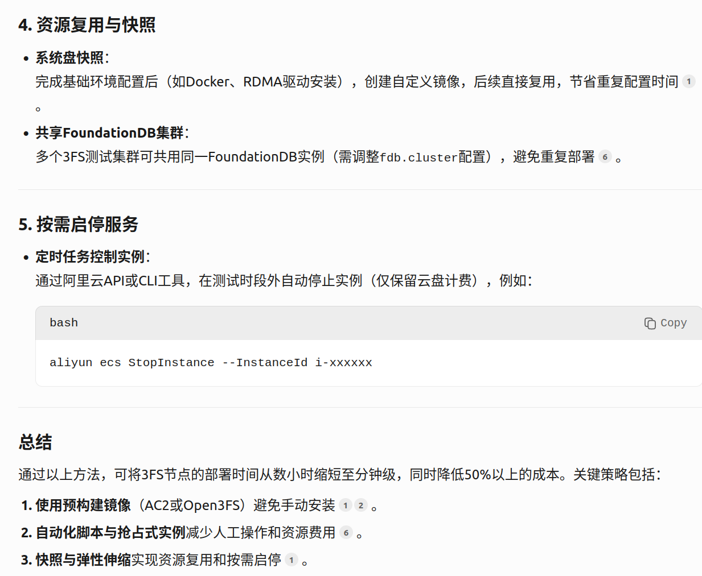
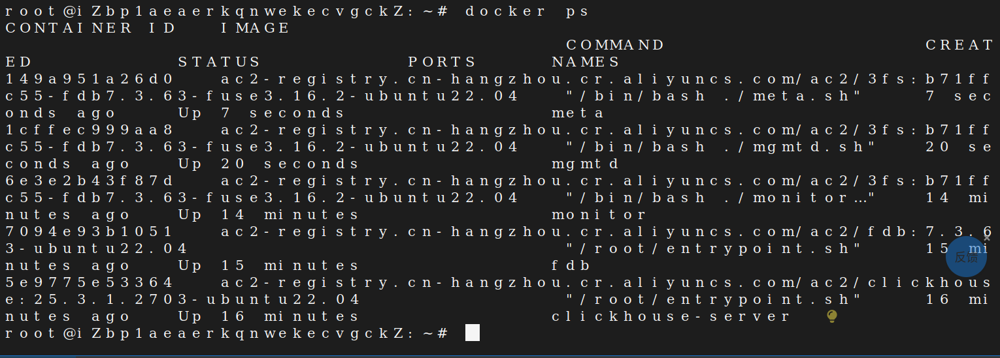
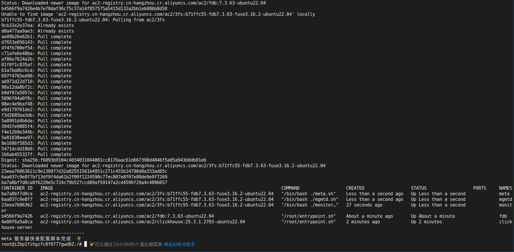
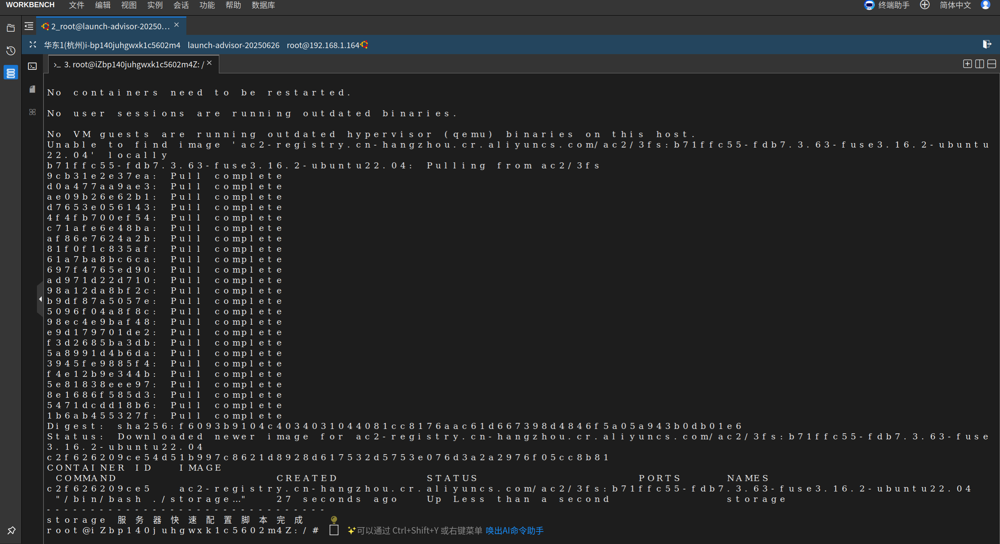
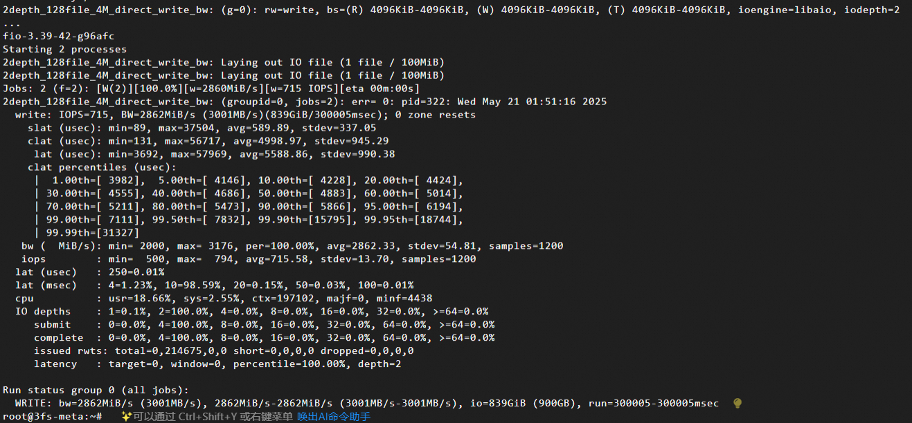

# 3FS部署指南

## PB23111729 吕祖灿

目前主要参考：https://zhuanlan.zhihu.com/p/27571661405
更多参考文档见项目文档

## 尝试1：本机Docker部署（本机RAM不足，无法部署）

### 硬件检查

1. 查询电脑是否支持NVme-SSD
2. RDMA是否需要支持待定

### Docker安装

+ 参考文档：https://blog.csdn.net/u011278722/article/details/137673353
+ 注意事项：
  + 使用daocloud，不要使用官方路径（国内无法正常访问，开梯子也没成功）

### 3fs Dockerfile构建

+ Dockerfile学习参考文档：https://www.runoob.com/docker/docker-dockerfile.html
+ 具体操作参考文档：https://zhuanlan.zhihu.com/p/27571661405

## 尝试2：云服务器Docker部署

一些注意事项：

1. 购买ECS实例时选择支持eRDMA的规格（如ecs.g8i系列），并直接选用AC2镜像（如ac2-registry.cn-hangzhou.cr.aliyuncs.com/ac2/3fs）。阿里云提供的AC2（AI Containers）镜像已预装了3FS所需的组件（如FoundationDB、ClickHouse等），无需手动下载和编译，可节省数小时的部署时间
2. Open3fs工具链：开源工具m3fs提供一键部署脚本，支持非RDMA环境模拟，30秒内可完成20节点集群部署
3. 对于必须手动安装的组件（如FoundationDB），使用自动化脚本减少操作时间
4. 并行化部署：使用rsync或ansible工具同步配置文件和二进制到多个节点，避免逐个节点操作。
   1. 跳过非必要步骤：测试环境中可禁用详细日志收集（如ClickHouse监控），减少资源占用
   2. 使用目录模拟NVMe SSD（通过m3fs工具），避免真实SSD的格式化与挂载时间

我的实践流程尝试1：参考https://help.aliyun.com/zh/ecs/use-cases/deploy-3fs-distributed-storage-cluster-with-erdma#5bee71f080ybe

1. 配置方案

+ meta:ecs.g8i.2xlarge
+ storage1-5:ecs.i4.xlarge

2. meta配置：
   1. 按照教程来
3. storage配置：每个服务器是一个NVMe SSD盘，一个分区，NVMe0n1p1
4. 上传脚本文件，先给文件加权限，然后执行

Deploy images:

1. 原版3fs meta模块部署成功的画面
2. 脚本配置3fs meta模块成功：
3. 脚本配置3fs storage模块成功：

最终部署

## 尝试3：多台云服务器部署（最终方案）
   **详情见杨奕麟《3fs部署指南》**
