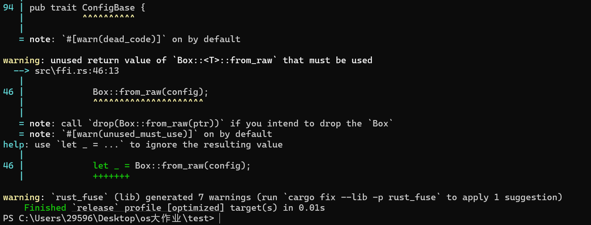

rust-cpp-mixed/
├── Cargo.toml
├── build.rs
├── src/
│   ├── lib.rs          # 入口：暴露 extern "C" 函数
│   ├── fuse_app_config.rs  # 你的 FuseAppConfig 实现
│   └── ffi.rs              # FFI 层，连接 Rust 和 C++
├── include/
│   └── rust_fuse_ffi.h     # C 接口头文件，供 C++ 调用
└── cpp/
    ├── main.cpp            # 示例 C++ 调用代码
    └── CMakeLists.txt      # CMake 构建脚本

运行
    cargo build --release
可以生成.dll等文件，在target文件夹内
