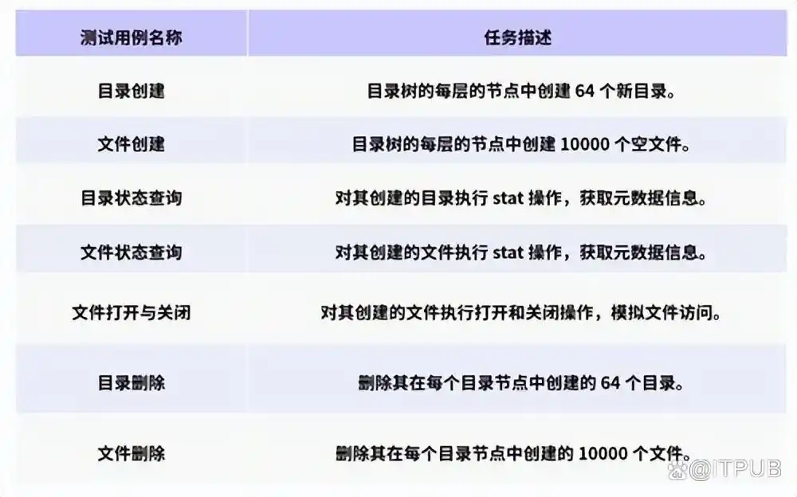
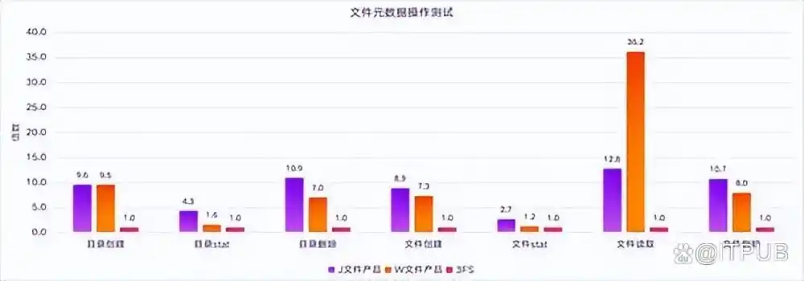
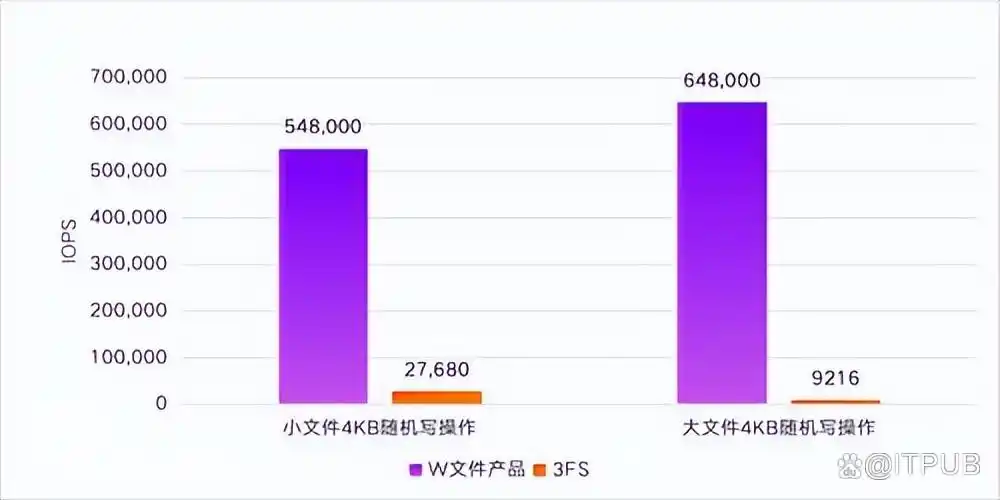
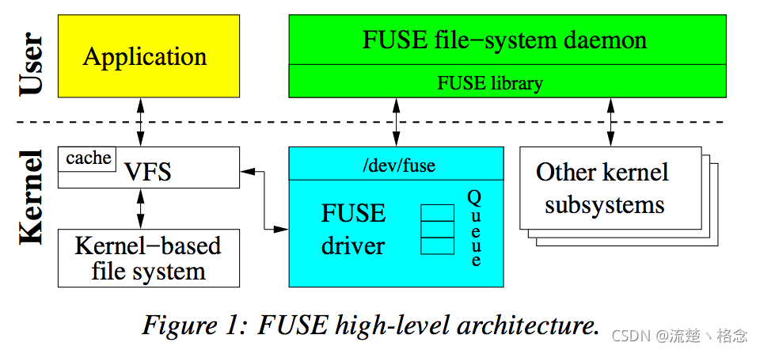
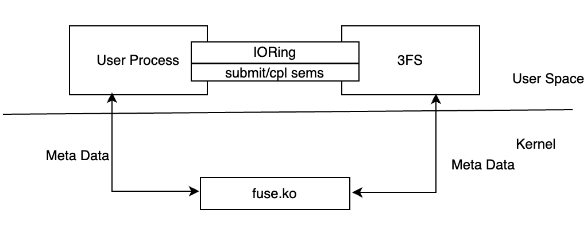

### 立项依据
---

#### 需求与挑战：3FS核心模块局限性/Rust语言优势​

**3FS核心模块局限性**

**链式复制协议问题：** 3FS采用链式复制协议，这使得写入操作的时延增大。因为链式复制需要逐个节点进行数据复制，一旦链中的某个节点出现延迟或故障，就会影响整个写入过程的效率。虽然CRAQ协议改进后支持在任意节点读取，但写操作仍然需要等待脏块（即尚未同步到所有副本的数据块）更新完成，这无疑增加了写入的等待时间。这种写入性能瓶颈在高并发写入场景下尤为明显，限制了3FS在对写入性能要求较高的应用场景中的适用性。

***模拟场景示例分析***

***分布式数据库写入场景：*** 高并发写入时，写入延迟高，在对写入性能要求较高的金融交易系统、股票交易系统等场景中，3FS无法满足低延迟、高吞吐量的要求，可能导致数据库事务处理能力受限、事务积压、系统崩溃或用户体验下降。

***大数据实时分析场景：*** 数据采集模块在高并发写入时，数据可能在缓冲区积压，导致缓冲区溢出，数据丢失，且数据到达存储系统的延迟增加，分析模块无法及时获取最新数据，影响分析结果的实时性和准确性。在需要实时监控和预警的环境监测系统、工业生产监控系统等场景中，3FS无法满足对低延迟、高可靠性写入的要求，可能导致分析结果不准确或预警延迟。

***云计算环境中的虚拟机镜像存储场景：*** 高并发写入时，虚拟机镜像创建时间从正常1分钟增加到5分钟甚至更长，虚拟机镜像更新可能超时或失败，导致数据不一致问题。在需要快速创建和更新虚拟机的云计算平台中，3FS无法满足高性能写入的要求，可能导致用户体验不佳、系统效率低下。

**FoundationDB的KV存储逻辑问题：** 3FS的设计文档明确建议用户通过FFRecord或其他开源数据格式合并小文件，因为系统并未针对传统文件系统的小文件读写进行深度优化，甚至出于对Deepseek的定向设计一定程度上牺牲了小文件读写性能。下面给出小文件操作实测数据。

首先在测试目录下创建深度为8、每层目录创建64个子目录的目录树。然后基于这个目录树执行以下测试用例：

把结果跟其他并行文件系统（J文件产品和W文件产品）进行对比，能够明显发现3FS在小文件场景性能不足。图中以3FS的各个元数据操作OPS测试结果为基准值。

在小文件写操作测试（4KB随机写），因为4KB比FileSize/ChunkSize小，属于局部更新数据，所以底层存储触发读改写，假如FileSize是16KB，则读写放大是8倍。假如FileSize比ChunkSize （1MB）大，那么读写放大是1280倍，这导致性能极其差。而且假如小文件的FileSize小于ChunkSize，则会有严重的存储空间浪费。

通过以上测试数据可以看到，3FS对于小文件场景和随机小块更新写入出现远低于行业 一流水平的性能结果。这是3FS为适配Deepseek做出的牺牲。

**安全性/稳定性待提升：** 3FS在安全性与稳定性方面存在改进空间。这可能体现在多个方面，例如其在面对复杂的网络环境、硬件故障或恶意攻击时，可能无法很好地保障数据的完整性和系统的持续稳定运行。这在当今数据价值日益凸显、安全要求极高的市场环境中是一个不可忽视的缺陷。

**Rust语言优势** 

**内存安全与并发优势：** Rust语言以其强大的内存安全特性而闻名。它通过所有权系统、生命周期等机制，在编译时就能检测出许多可能导致内存错误（如空指针引用、数据竞争等）的代码问题。这与3FS在安全性方面的需求相契合，能够有效弥补3FS在安全性上的不足。同时，Rust对并发编程提供了良好的支持，能够更好地利用现代多核处理器的性能，从而在一定程度上提升系统的整体性能，尤其是在高并发读写操作的场景下，有助于缓解3FS链式复制协议带来的写入时延问题。

**性能与安全性平衡：** Rust在追求内存安全的同时，并没有牺牲太多的性能。它生成的代码运行效率较高，接近于传统的C/C++语言。这种在性能与安全性之间取得良好平衡的特性，使其成为对3FS核心模块进行升级优化的理想选择之一，能够在提升安全性的同时，尽量减少对系统性能的负面影响。

**我们想做的就是通过使用Rust改写3FS核心模块内容，利用Rust在内存安全、高并发等方面的天然优势，弥补3FS在定向Deepseek设计时牺牲的小文件操作性能和高并发读写风险。**

#### FUSE接口局限与XFUSE的潜在优势

**FUSE自身局限**

**内存复制开销：** 当3FS通过FUSE接口与用户空间交互时，存在内存复制的开销。这是因为FUSE需要在内核空间和用户空间之间频繁地进行数据拷贝，这不仅增加了系统的负担，还可能导致性能下降。尤其是在处理大量数据或高频率的文件操作时，这种内存复制开销会更加明显，从而影响系统的整体性能。

**多线程支持不足：** FUSE接口的原始多线程支持不足，这在多线程环境下可能会导致性能瓶颈。现代操作系统和应用程序通常会利用多线程来提高效率，但FUSE接口的这一缺陷限制了3FS在多线程场景下的性能表现。例如，在多用户同时访问文件系统或进行复杂的文件操作时，可能会出现线程阻塞、资源竞争等问题，进而影响用户体验和系统效率。

**XFUSE潜在优势**

**性能提升潜力：** XFUSE作为一种可能的替代方案，如果能够增加3FS对XFUSE的兼容性，有望提升性能。XFUSE可能在设计上对内存复制和多线程支持进行了优化，从而能够更好地满足3FS在高性能场景下的需求。通过减少内存复制开销和改善多线程支持，可以提高文件系统的响应速度和吞吐量，使得3FS在处理高并发文件操作时更加高效。

**适应现代应用架构：** 现代应用架构越来越依赖多线程和高效的内存管理来实现高性能。XFUSE的兼容性改进可以使3FS更好地适应这种趋势，从而在云计算、大数据处理等对性能要求较高的领域更具竞争力。这不仅有助于提升3FS的市场应用前景，还能够满足用户对高性能文件系统的需求。

**3FS与FUSE**

3FS采用FUSE接口，Fuse包含一个内核模块和一个用户空间守护进程（下文称fuse daemon）。内核模块加载时被注册成Linux虚拟文件系统的一个fuse文件系统驱动。此外，还注册了一个/dev/fuse的块设备。该块设备作为fuse daemon与内核通信的桥梁，fuse daemon通过/dev/fuse读取fuse request，处理后将reply写入/dev/fuse。

上图详细展示了fuse的构架。当application挂在fuse文件系统上，并且执行一些系统调用时，VFS会将这些操作路由至fuse driver，fuse driver创建了一个fuse request结构体，并把request保存在请求队列中。此时，执行操作的进程会被阻塞，同时fuse daemon通过读取/dev/fuse将request从内核队列中取出，并且提交操作到底层文件系统中(例如EXT4或F2FS)。当处理完请求后，fuse daemon会将reply写回/dev/fuse，fuse driver此时把requset标记为completed，最终唤醒用户进程。

3FS 的客户端不仅支持通过 FUSE 进行文件操作，还提供了一组 Native Client API，允许用户绕过 FUSE 直接访问数据。这些 API 的设计类似于 Linux AIO（异步 I/O），旨在避免使用 FUSE 时产生的数据拷贝，从而减少 I/O 延迟并降低内存带宽的占用。

**总的来说，3FS 的 FUSE 客户端实现了文件和目录的基本操作，尽管通过API实现零拷贝减少数据拷贝带来的性能损失，但很多例如 JuiceFS 的 FUSE 客户端功能相比都更加全面。所以，我们希望能拓展3FS对XFUSE接口的支持，减少原FUSE的内存复制开销和多线程优化，进一步适配3FS在零拷贝技术方面的突破。**

#### 应用前景广阔

预期升级后的3FS系统将能够更好地满足市场对高性能、高可用性文件系统的需求，具有广阔的市场应用前景。
​
边缘计算需要低延迟/高分布式计算能力，升级后有望优化3FS的小文件操作和高并发写延迟，使3FS更好地适配边缘计算方面的应用。​

物联网需要对数据的快速访问与完整传输，升级后Rust语言的天然安全性搭配3FS的读取能力和强一致性正适配这些要求。

#### 技术可行性与团队提升

**技术可行性**

**初步研究基础：** 对现有系统的初步理解是开展后续工作的前提条件。我们已经初步了解了3FS文件系统结构，为后续的升级优化工作奠定了基础。我们对3FS的核心架构和关键模块有了基本的认识，能够初步判断哪些部分存在优化空间，以及如何进行改进。

**Rust语言学习与结合性研究：** 我们初步学习了Rust语言，并调查了3FS与Rust之间的可结合性，尝试将Rust语言的优势应用到3FS的升级中。

**性能提升预期：** 基于现有的研究和分析，我们初步判断在升级核心模块后（如XFUSE接口，Rust改写）会得到一定的性能提升。从上文的分析来看，3FS的核心模块和接口确实存在一些局限性，而Rust语言和XFUSE接口的引入有望解决这些问题。虽然具体的性能提升幅度还需要通过实际的测试和验证来确定，这对于我们这种小团队来说存在极大难度，但这种预期为项目的立项提供了信心。

**团队提升**
**操作系统课程学习与实践：** 我们希望通过参与3FS的升级项目，提升对操作系统课程的理解和掌握。通过对3FS这一实际系统的深入研究和改进，将理论知识与实践相结合，加深对操作系统原理、文件系统设计等方面的理解，从而在知识的理解与应用中得到提升。

**团队技术能力拓展：** 参与这样的项目可以帮助我们拓展技术能力，提高我们对新兴技术（如Rust语言、3FS）的了解、对复杂系统的优化能力以及团队协作和项目管理能力等。这不仅有助于我们每个人的职业发展，也能够提升整个团队在相关领域的竞争力，为未来承担更多类似的项目奠定基础。

**参考文献：（后面放一起补充进去）**

https://cloud.tencent.com/developer/article/2507444 AI训练存储方案选谁？DeepSeek 3FS与JuiceFS的全面对比 2025.3.24

https://baijiahao.baidu.com/s?id=1825807801365317075 XSKY 实测 DeepSeek 3FS：小文件写性能让步，成就极致吞吐量 2025.3.6

https://www.xsky.com/about/news/info/id/934.html 实测 DeepSeek 3FS：我们拆解了性能怪兽的暴力美学 2025.3.5

https://developer.volcengine.com/articles/7480397583173877797 DeepSeek 3FS 架构分析和思考 2025.3.11

https://zhuanlan.zhihu.com/p/26982661774 DeepSeek Fire-Flyer File System(3FS) 2025.2.28