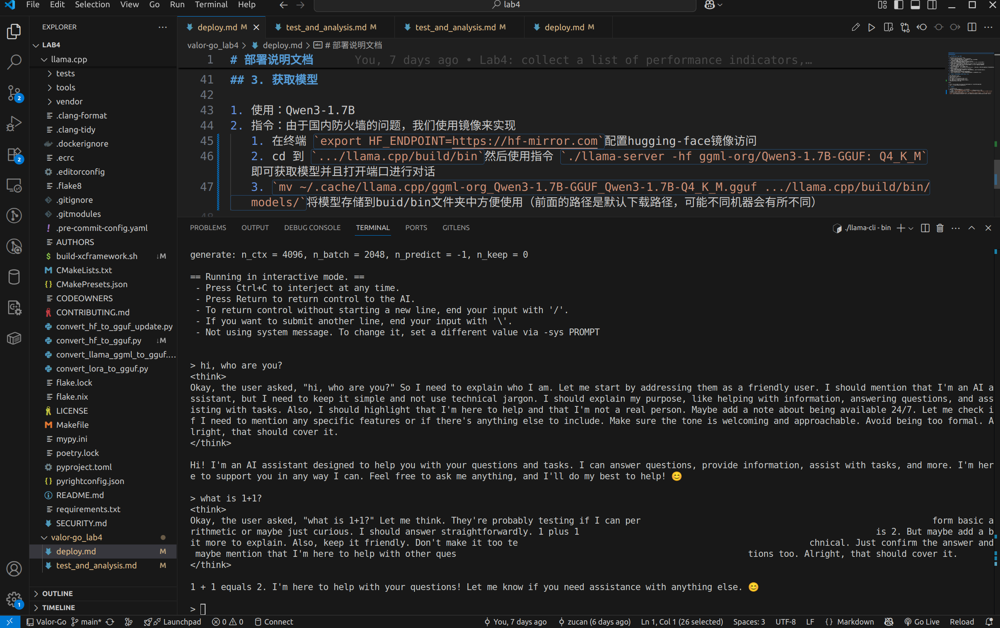
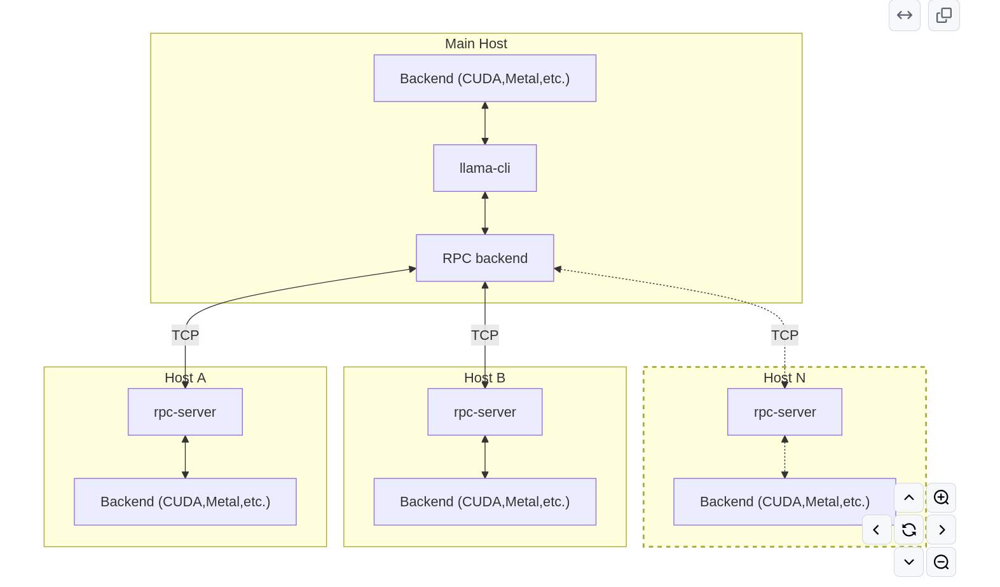
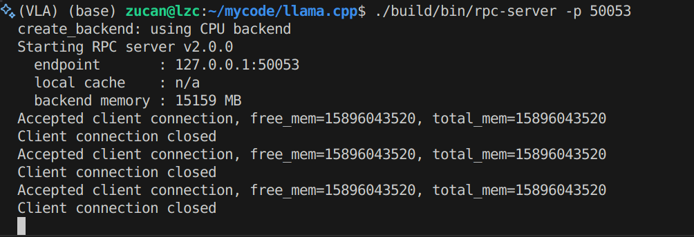

# 部署说明文档

## Valor-go Team

## 1. 本地编译
### 1.1 编译相关配置（强烈推荐和文档配置保持一致）
请根据自己的GPU等配置选择对应的CUDA版本和编译器版本,详细安装文档见llama.cpp官方文档和CUDA官方文档

1. 操作系统：Ubuntu 22.04
2. Driver Version: 550.163.01
3. CUDA Version: 12.4
4. gcc (Ubuntu 11.4.0-1ubuntu1~22.04) 11.4.0
5. g++ (Ubuntu 11.4.0-1ubuntu1~22.04) 11.4.0
6. CPU: AMD Ryzen 9 7945HX with Radeon Graphics
7. GPU:NVIDIA GeForce RTX 4060

说明：

1. Driver Version，CUDA Version，gcc，g++各版本需要保持一致，否则可能无法编译
2. 不建议使用clang，CUDA对clang支持不太好

### 1.2 编译指令
```
git clone https://github.com/ggml-org/llama.cpp.git
cd llama.cpp

# CPU Backend
cmake -B build
cmake --build build --config Release
# cmake --build build --config Release -j 8 # -j 8 可加速编译过程，视你的 CPU 核心数而定

# CUDA Backend, require have CUDA toolkit: https://developer.nvidia.com/cuda-toolkit installed
cmake -B build -DGGML_CUDA=ON
cmake --build build --config Release
```
## 2. 获取模型

1. 使用：Qwen3-1.7B
2. 指令：由于国内防火墙的问题，我们使用镜像来实现
   1. 在终端 `export HF_ENDPOINT=https://hf-mirror.com`配置hugging-face镜像访问
   2. cd 到 `.../llama.cpp/build/bin`然后使用指令 `./llama-server -hf ggml-org/Qwen3-1.7B-GGUF: Q4_K_M`即可获取模型并且打开端口进行对话
   3. `mv ~/.cache/llama.cpp/ggml-org_Qwen3-1.7B-GGUF_Qwen3-1.7B-Q4_K_M.gguf .../llama.cpp/build/bin/models/`将模型存储到buid/bin文件夹中方便使用（前面的路径是默认下载路径，可能不同机器会有所不同）
3. 部署成功截图：

## 3. RPC分布式部署
RPC示意图：


我们的分布式部署是在两台不同的Ubuntu机器上进行的
A机(GPU编译)：
1. 操作系统：Ubuntu 22.04
2. cc (Ubuntu 11.4.0-1ubuntu1~22.04) 11.4.0
3. g++ (Ubuntu 11.4.0-1ubuntu1~22.04) 11.4.0
4. CPU: AMD Ryzen 9 7945HX with Radeon Graphics
5. GPU:NVIDIA GeForce RTX 4060
6. Driver Version: 550.163.01
7. CUDA Version: 12.4
   
B机(CPU编译)：
1. 操作系统：Ubuntu 22.04
2. gcc (Ubuntu 11.4.0-1ubuntu1~22.04) 11.4.0
3. g++ (Ubuntu 11.4.0-1ubuntu1~22.04) 11.4.0
4. CPU：Intel(R) Core(TM) i5-7200U CPU @ 2.50GHz

### 3.1 网络环境准备
为确保两台机器网络互通，两台机器均连接同一手机热点
### 3.2 在各主机上分别编译llama.cpp
```
CPU编译
cmake -B build -DGGML_RPC=ON 
cmake --build build --config Release

GPU编译
cmake -B build -DGGML_CUDA=ON -DGGML_RPC=ON 
cmake --build build --config Release
```
### 3.3 启动RPC服务
+ 在两台电脑终端分别执行`./build/bin/rpc-server -p 50052`或`./build/bin/rpc-server -p 50053`
+ 若目标节点端口为50053,则在端口为50052的机器上执行对应操作指令,如`./build/bin/llama-cli -m ./build/bin/models/ggml-org_Qwen3-1.7B-GGUF_Qwen3-1.7B-Q4_K_M.gguf -p "who are you?" --rpc 172.20.10.8:50053`,这里的ip地址可以使用`ip addr show`查看并更换
+ 执行后将在端口为50053的电脑终端中出现：  表明运行正常，正在接受客户端连接请求；在端口为50052的电脑终端可正常执行各种功能

